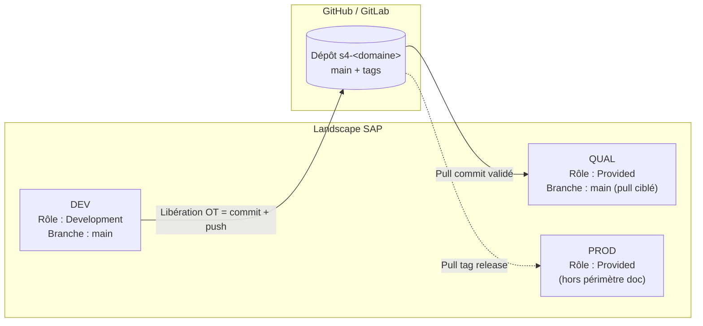
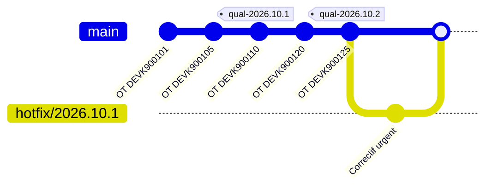
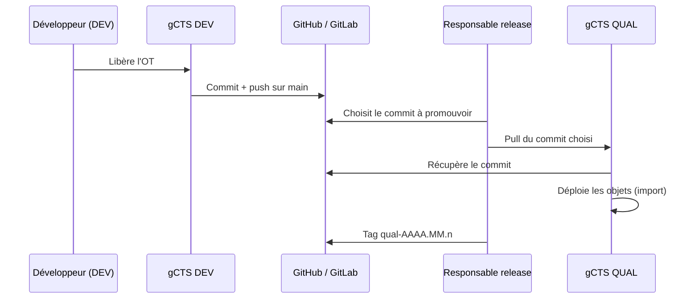

# gCTS avec SAP S/4HANA 2021 FPS02 et GitHub / GitLab

> **Objet** : installer, configurer et utiliser le *Git-enabled Change and Transport System* (gCTS) sur S/4HANA 2021 FPS02 (SAP_BASIS 7.56), avec GitHub ou GitLab comme serveur Git distant.
> **Périmètre de la documentation** : systèmes **DEV** et **QUAL** (la **PROD** est décrite dans l'architecture cible, mais n'est pas déroulée dans ce guide).

> ⚠️ Les noms de paramètres, catalogues Fiori et prérequis techniques évoluent selon le niveau de Support Package. Avant toute installation, vérifier la **note centrale gCTS 2821718** et les notes qu'elle référence pour votre niveau SP.

---

## Sommaire

1. [Principes de gCTS](#1-principes-de-gcts)
2. [Architecture cible](#2-architecture-cible)
3. [Recommandation : architecture des dépôts](#3-recommandation--architecture-des-dépôts)
4. [Recommandation : gestion des branches](#4-recommandation--gestion-des-branches)
5. [Prérequis](#5-prérequis)
6. [Installation et configuration technique (DEV et QUAL)](#6-installation-et-configuration-technique-dev-et-qual)
7. [Préparation côté GitHub / GitLab](#7-préparation-côté-github--gitlab)
8. [Création et configuration du dépôt dans gCTS](#8-création-et-configuration-du-dépôt-dans-gcts)
9. [Utilisation au quotidien](#9-utilisation-au-quotidien)
10. [Promotion DEV → QUAL](#10-promotion-dev--qual)
11. [Dépannage](#11-dépannage)
12. [Annexes](#12-annexes)

---

## 1. Principes de gCTS

gCTS relie le système de transport ABAP (CTS) à un dépôt Git :

| Concept SAP | Équivalent Git |
|---|---|
| Libération d'un ordre de transport | **Commit** (+ push vers le dépôt distant) |
| Import dans un système cible | **Pull** d'un commit précis (déploiement des objets) |
| Système virtuel (vSID) dans STMS | Cible de transport rattachée au dépôt |
| Rôle du dépôt *Development* | Le système produit des commits |
| Rôle du dépôt *Provided* | Le système consomme des commits (pas de modifications locales) |

Points importants :

- Un système ABAP n'a **qu'une seule version active** d'un objet. Changer de branche dans gCTS **redéploie les objets** de la branche dans le système. On ne fait donc pas de « feature branches » parallèles dans un même système DEV comme on le ferait en développement classique.
- Git sert ici de **référentiel de versions, d'historique et de point de distribution**, pas d'outil de développement parallèle.

<!-- 📸 CAPTURE 01 : Vue d'ensemble de la tuile gCTS dans le Fiori Launchpad de DEV (page d'accueil listant les dépôts) -->


---

## 2. Architecture cible



<!-- 📸 CAPTURE 02 : STMS – Vue du landscape de transport en DEV montrant DEV, QUAL et le système virtuel (vSID) gCTS -->


---

## 3. Recommandation : architecture des dépôts

### 3.1 Granularité

**Recommandation : un dépôt Git par domaine fonctionnel / composant logiciel, regroupant un ou plusieurs paquets ABAP cohérents.**

| Option | Avantages | Inconvénients | Verdict |
|---|---|---|---|
| Un dépôt unique pour tout le système | Simple à mettre en place | Historique illisible, pulls massifs, pas de séparation des responsabilités | ❌ À éviter |
| Un dépôt par paquet | Très fin | Explosion du nombre de dépôts et de vSID, dépendances croisées difficiles | ❌ Sauf cas isolés |
| **Un dépôt par domaine / composant** | Historique lisible, déploiements ciblés, droits par équipe | Nécessite de bien découper les paquets | ✅ **Recommandé** |

Règles associées :

- Un **paquet ABAP** (et ses sous-paquets) appartient à **un seul dépôt**.
- Les **dépendances** entre dépôts doivent être unidirectionnelles (ex. `s4-common` ← `s4-sd-ext`). Les déclarer dans la configuration du dépôt (dépendances gCTS) et les documenter dans le `README.md` du dépôt.
- Le **customizing** et les objets Workbench ne sont pas mélangés : si nécessaire, un dépôt dédié au customizing.

### 3.2 Conventions de nommage

| Élément | Convention | Exemple |
|---|---|---|
| Organisation / groupe Git | `<entreprise>-sap` | `acme-sap` |
| Dépôt Git | `s4-<domaine>-<composant>` | `s4-mm-sourcing` |
| Paquet ABAP racine | `Z<DOMAINE>_<COMPOSANT>` | `ZMM_SOURCING` |
| vSID gCTS | 3 caractères, préfixe réservé, ne collisionnant avec aucun SID réel | `G01`, `G02`… |
| Transport layer | `Z` + identifiant court | `ZG01` |

<!-- 📸 CAPTURE 03 : GitHub / GitLab – organisation ou groupe listant les dépôts SAP selon la convention de nommage -->


### 3.3 Contenu d'un dépôt

```
s4-mm-sourcing/
├── README.md                 # objectif, paquets inclus, dépendances, contacts
├── CODEOWNERS                # (GitHub) / règles d'approbation (GitLab)
├── .gcts.properties.json     # généré et géré par gCTS – ne pas modifier à la main
└── objects/ (ou src/)        # sérialisation des objets ABAP, gérée par gCTS
```

> Ne jamais modifier directement les fichiers d'objets ABAP dans Git (web IDE, commit manuel) : le système DEV reste la seule source de vérité des objets.

<!-- 📸 CAPTURE 04 : Arborescence du dépôt dans GitHub / GitLab après le premier push depuis DEV -->


---

## 4. Recommandation : gestion des branches

### 4.1 Stratégie recommandée : *trunk-based* + tags

Compte tenu de la contrainte « une seule version active par système » et du landscape DEV → QUAL → PROD :



| Branche / référence | Rôle | Alimentée par | Consommée par |
|---|---|---|---|
| `main` | Branche unique de référence, chaque commit = un OT libéré en DEV | DEV (push automatique à la libération) | QUAL (pull d'un commit précis) |
| Tags `qual-AAAA.MM.n` | Marque la version déployée / validée en QUAL | Responsable release (GitHub/GitLab) | Traçabilité, futur pull en PROD |
| Tags `prod-AAAA.MM.n` | Version mise en production (hors périmètre doc) | Responsable release | PROD |
| `hotfix/*` (optionnel) | Correctif urgent si un système de maintenance existe | Système de maintenance | Fusion vers `main` |

### 4.2 Pourquoi pas une branche par environnement (`dev` / `qual` / `prod`) ?

C'est possible (QUAL suit la branche `qual`, alimentée par Merge Request / Pull Request depuis `main`), et cela apporte une **porte de revue dans GitHub/GitLab**. Mais :

- les merges ne réordonnent pas les dépendances entre OT : un merge partiel peut produire un état jamais testé en DEV ;
- les fusions « à rebours » (hotfix) deviennent vite complexes ;
- gCTS sait déjà déployer un **commit précis** en QUAL, ce qui couvre le besoin de sélection.

**Recommandation** : rester sur `main` + tags. Ne passer aux branches par environnement que si une **revue de code obligatoire dans GitHub/GitLab** avant QUAL est exigée par la gouvernance — dans ce cas, n'autoriser que des merges *fast-forward* de `main` vers `qual`.

### 4.3 Règles de protection

| Règle | GitHub | GitLab |
|---|---|---|
| Interdire le push direct humain sur `main` | Branch protection rule, restreindre aux comptes techniques gCTS | Protected branch, *Allowed to push* = utilisateur technique |
| Interdire le force-push et la suppression | ✅ | ✅ |
| Tags `qual-*` / `prod-*` protégés | Tag protection rule / rulesets | Protected tags |

<!-- 📸 CAPTURE 05 : GitHub – Settings > Branches (ou Rules) montrant la protection de main -->


<!-- 📸 CAPTURE 06 : GitLab – Settings > Repository > Protected branches / Protected tags -->


---

## 5. Prérequis

### 5.1 Côté SAP (DEV et QUAL)

| Prérequis | Détail |
|---|---|
| Release | S/4HANA 2021 FPS02 (SAP_BASIS 7.56 SP02) |
| Notes | Note centrale **2821718** + notes de correction listées pour votre SP (SNOTE) |
| Runtime Java | Le client Git de gCTS s'appuie sur un runtime Java (SAP JVM 8 / SapMachine) sur chaque serveur d'application — version exacte à confirmer dans la note centrale |
| Accès réseau | Sortie HTTPS (443) des serveurs d'application vers `github.com` / `api.github.com` ou votre instance GitLab (proxy le cas échéant) |
| Certificats | Chaîne de certificats du serveur Git importée dans STRUST |
| TMS | Domaine de transport configuré (DEV et QUAL dans le même domaine) |
| Fiori | Launchpad actif, catalogue gCTS attribué (ex. `SAP_BASIS_TCR_T` — à confirmer selon SP) |
| Autorisations | Objets d'autorisation gCTS (`S_GCTS_SYS`, `S_GCTS_R`, `S_GCTS_C` selon SP) + autorisations TMS |

### 5.2 Côté Git

- Une organisation (GitHub) ou un groupe (GitLab) dédié SAP.
- Un **compte technique** (ou un token par développeur, voir §7.2).
- Des tokens d'accès personnels (PAT) avec les scopes nécessaires.

### 5.3 Matrice des rôles

| Rôle | DEV | QUAL | Git |
|---|---|---|---|
| Administrateur gCTS (Basis) | Config système, création dépôts | Config système, clone, pull | Admin organisation/groupe |
| Développeur | Libération OT (push auto) | Lecture | Lecture |
| Responsable release | Lecture | Pull de commits, tags | Création de tags, revue |

---

## 6. Installation et configuration technique (DEV et QUAL)

> Les étapes 6.1 à 6.6 sont à réaliser **sur DEV puis sur QUAL**. Prévoir une capture par système lorsque c'est indiqué.

### 6.1 Implémenter les notes SAP

1. Transaction `SNOTE` : télécharger et implémenter la note centrale 2821718 et ses prérequis.
2. Vérifier l'absence de notes de correction gCTS en attente.

<!-- 📸 CAPTURE 07 : SNOTE en DEV – statut « complètement implémentée » de la note 2821718 -->


<!-- 📸 CAPTURE 08 : SNOTE en QUAL – même vérification -->


### 6.2 Installer et déclarer le runtime Java

1. Installer SAP JVM / SapMachine sur chaque serveur d'application (équipe Basis / OS).
2. Noter le chemin d'installation (ex. `/usr/sap/<SID>/SYS/global/sapjvm` ou chemin OS dédié).
3. Le déclarer dans la configuration système gCTS (voir §6.5).

<!-- 📸 CAPTURE 09 : Terminal OS – `java -version` sur le serveur DEV -->


### 6.3 Activer les services ICF

Transaction `SICF` : activer
- le service REST gCTS : `/sap/bc/cts_abapvcs`
- l'application UI5 gCTS (sous `/sap/bc/ui5_ui5/sap/…`, nom selon SP)

<!-- 📸 CAPTURE 10 : SICF en DEV – service /sap/bc/cts_abapvcs actif -->


<!-- 📸 CAPTURE 11 : SICF en QUAL – service /sap/bc/cts_abapvcs actif -->


### 6.4 Importer les certificats SSL

1. Récupérer la chaîne de certificats de `github.com` / `api.github.com` (ou de votre GitLab) : racine + intermédiaire.
2. Transaction `STRUST` → **SSL client Anonymous** et **SSL client Standard** → *Import certificate* → *Add to certificate list* → *Save*.
3. Si le client Java utilise son propre magasin de confiance, importer également les certificats dans le keystore Java (voir note centrale).

<!-- 📸 CAPTURE 12 : STRUST en DEV – certificats GitHub/GitLab présents dans SSL client Anonymous -->


<!-- 📸 CAPTURE 13 : STRUST en QUAL – mêmes certificats -->


### 6.5 Configurer TMS pour gCTS

Sur le **contrôleur de domaine** (`STMS`) :

1. **Créer le système virtuel** correspondant au vSID du dépôt (ex. `G01`) : *Vue d'ensemble > Systèmes > Créer > Système virtuel*.
2. **Créer la couche de transport** `ZG01` et la **route de consolidation** `DEV → G01`.
3. Affecter le(s) paquet(s) ABAP du domaine à la couche `ZG01` (`SE80` / `SE21`).
4. Configurer les paramètres de transport du système virtuel selon la documentation gCTS (paramètres liés au VCS, ex. `NON_ABAP_WBO_CLIENT` / `VCS_*` selon SP).
5. Distribuer et activer la configuration.

<!-- 📸 CAPTURE 14 : STMS – création du système virtuel G01 -->


<!-- 📸 CAPTURE 15 : STMS – éditeur graphique des routes montrant DEV → G01 (couche ZG01) -->


<!-- 📸 CAPTURE 16 : SE80 / SE21 – paquet ZMM_SOURCING rattaché à la couche ZG01 -->


### 6.6 Configuration système dans l'application gCTS

Ouvrir la tuile **gCTS** (Git-enabled Change and Transport System) → **Configuration système**.

1. Lancer le **Health Check** : tous les contrôles doivent être verts (Java, répertoires, RFC/TMS, certificats).
2. Renseigner les paramètres système, par exemple :

| Paramètre | Valeur DEV | Valeur QUAL | Commentaire |
|---|---|---|---|
| Chemin du runtime Java | `/…/sapjvm/bin` | `/…/sapjvm/bin` | Selon installation |
| Répertoire de travail gCTS | défaut | défaut | Clones locaux sur le serveur |
| `CLIENT_VCS_CONNTYPE` | `ssl` | `ssl` | Connexion HTTPS |
| `CLIENT_VCS_LOGLVL` | `info` | `info` | `debug` uniquement en dépannage |

<!-- 📸 CAPTURE 17 : Tuile gCTS en DEV – écran Configuration système avec Health Check entièrement vert -->


<!-- 📸 CAPTURE 18 : Tuile gCTS en QUAL – Health Check entièrement vert -->


<!-- 📸 CAPTURE 19 : Tuile gCTS en DEV – liste des paramètres système configurés -->


---

## 7. Préparation côté GitHub / GitLab

### 7.1 Créer le dépôt

| | GitHub | GitLab |
|---|---|---|
| Emplacement | Organisation `acme-sap` | Groupe `acme-sap` |
| Visibilité | **Private** | **Private** |
| Initialisation | Avec un `README.md` (crée la branche `main`) | Idem |
| Endpoint API à déclarer dans gCTS | `https://api.github.com` | `https://<instance>/api/v4` |

<!-- 📸 CAPTURE 20 : GitHub – écran de création du dépôt s4-mm-sourcing (privé, avec README) -->


<!-- 📸 CAPTURE 21 : GitLab – écran de création du projet s4-mm-sourcing -->


### 7.2 Créer les tokens d'accès

**Option recommandée** : un **compte technique** par système SAP (ex. `sap-gcts-dev`, `sap-gcts-qual`) :
- DEV : droits **écriture** (push) sur les dépôts concernés ;
- QUAL : droits **lecture** seule.

| | GitHub | GitLab |
|---|---|---|
| Type de token | Fine-grained PAT (ou classic avec scope `repo`) | Personal / Project / Group Access Token |
| Droits DEV | Contents : Read & Write, Metadata : Read | `read_repository`, `write_repository`, `api` |
| Droits QUAL | Contents : Read, Metadata : Read | `read_repository`, `read_api` |
| Expiration | Définie (ex. 1 an) + rappel de renouvellement | Idem |

> Stocker les tokens dans le coffre-fort de l'équipe Basis. Ne jamais les écrire dans la documentation.

<!-- 📸 CAPTURE 22 : GitHub – écran de création du fine-grained token (scopes visibles, valeur du token MASQUÉE) -->


<!-- 📸 CAPTURE 23 : GitLab – écran de création de l'access token (scopes visibles, valeur MASQUÉE) -->


### 7.3 Protéger la branche `main` et les tags

Appliquer les règles du §4.3 (captures 05 et 06).

---

## 8. Création et configuration du dépôt dans gCTS

### 8.1 Déclarer les identifiants (DEV puis QUAL)

Tuile gCTS → **Configuration utilisateur** (ou identifiants du dépôt) :
1. *Ajouter* un endpoint : `https://api.github.com` ou `https://<instance>/api/v4`.
2. Type d'authentification : **Token**.
3. Coller le token du compte technique du système.

<!-- 📸 CAPTURE 24 : Tuile gCTS en DEV – écran des identifiants avec l'endpoint API déclaré (token masqué) -->


<!-- 📸 CAPTURE 25 : Tuile gCTS en QUAL – écran des identifiants -->


### 8.2 Créer le dépôt en DEV (rôle *Development*)

Tuile gCTS → **Créer** :

| Champ | Valeur |
|---|---|
| Nom / ID | `s4-mm-sourcing` |
| URL du dépôt distant | `https://github.com/acme-sap/s4-mm-sourcing.git` |
| Rôle | **Development** |
| vSID | `G01` |
| Type | GitHub / GitLab |
| Visibilité | Private |

Puis :
1. **Cloner** le dépôt.
2. Vérifier que la branche active est `main`.
3. Onglet **Configuration** du dépôt :

| Paramètre | Valeur DEV | Rôle |
|---|---|---|
| `VCS_AUTOMATIC_PUSH` | `true` | Push automatique à la libération de l'OT |
| `VCS_AUTOMATIC_PULL` | `false` | Pas de pull automatique en DEV |
| `VCS_BUFFER_ONLY` | `false` | — |

<!-- 📸 CAPTURE 26 : Tuile gCTS en DEV – formulaire de création du dépôt (rôle Development, vSID G01) -->


<!-- 📸 CAPTURE 27 : Tuile gCTS en DEV – dépôt cloné, statut et branche main visibles -->


<!-- 📸 CAPTURE 28 : Tuile gCTS en DEV – onglet Configuration du dépôt (paramètres ci-dessus) -->


### 8.3 Créer le dépôt en QUAL (rôle *Provided*)

Même URL, mêmes identifiants (token lecture), mais :

| Champ / paramètre | Valeur QUAL |
|---|---|
| Rôle | **Provided** |
| vSID | `G01` (même vSID que DEV) |
| `VCS_AUTOMATIC_PUSH` | `false` |
| `VCS_AUTOMATIC_PULL` | **`false`** (le pull en QUAL est une décision de release, pas automatique) |

Puis **cloner** sans déployer (ou déployer l'état initial si le dépôt contient déjà des objets validés).

<!-- 📸 CAPTURE 29 : Tuile gCTS en QUAL – formulaire de création du dépôt (rôle Provided) -->


<!-- 📸 CAPTURE 30 : Tuile gCTS en QUAL – dépôt cloné, rôle Provided affiché -->


---

## 9. Utilisation au quotidien

### 9.1 Cycle développeur (DEV)

1. Créer un ordre de transport Workbench (`SE09` / `SE10`) : la cible est `G01` (via la couche `ZG01`).
2. Développer dans le paquet du domaine (ADT/Eclipse ou SAP GUI).
3. Libérer les tâches puis l'ordre.
4. gCTS crée automatiquement un **commit** dans le dépôt local et le **pousse** vers GitHub/GitLab.

<!-- 📸 CAPTURE 31 : SE09 en DEV – ordre de transport avec cible G01 avant libération -->


<!-- 📸 CAPTURE 32 : Tuile gCTS en DEV – onglet Historique / Commits montrant le commit lié à l'OT -->


<!-- 📸 CAPTURE 33 : GitHub / GitLab – page Commits de main montrant le même commit (ID et message avec n° d'OT) -->


<!-- 📸 CAPTURE 34 : GitHub / GitLab – vue « diff » d'un objet ABAP modifié dans le commit -->


### 9.2 Bonnes pratiques

- **Un OT = une unité fonctionnelle cohérente** : le commit Git hérite de la granularité de l'OT.
- Description d'OT normalisée, reprise dans le message de commit : `[MM-123] Ajout contrôle fournisseur bloqué`.
- Ne pas mélanger plusieurs domaines (dépôts) dans un même OT.
- Ne jamais changer de branche dans gCTS sur DEV sans coordination : cela redéploie les objets.

### 9.3 Consulter l'historique d'un objet

Dans la tuile gCTS → dépôt → **Objets** : historique des versions et commits par objet.

<!-- 📸 CAPTURE 35 : Tuile gCTS en DEV – historique d'un objet (liste des commits l'ayant modifié) -->


---

## 10. Promotion DEV → QUAL



Étapes :

1. Dans GitHub/GitLab (ou dans la tuile gCTS de QUAL → **Récupérer / Fetch**), identifier le **dernier commit validé** à promouvoir.
2. Tuile gCTS en **QUAL** → dépôt → **Commits** → sélectionner le commit → **Pull / Déployer**.
3. Contrôler le **journal d'activité** du dépôt (statut vert, objets importés).
4. Vérifier les objets dans QUAL (`SE80`, ADT, tests).
5. Créer le tag `qual-AAAA.MM.n` sur ce commit dans GitHub/GitLab.

> Le pull d'un commit déploie **l'état complet du dépôt à ce commit**, donc tous les OT antérieurs non encore importés. Toujours vérifier la liste des commits intermédiaires avant le pull.

<!-- 📸 CAPTURE 36 : Tuile gCTS en QUAL – liste des commits disponibles après Fetch, commit cible sélectionné -->


<!-- 📸 CAPTURE 37 : Tuile gCTS en QUAL – journal d'activité après le pull (statut succès) -->


<!-- 📸 CAPTURE 38 : SAP QUAL – objet ABAP déployé visible dans SE80 / ADT (comparaison avec DEV) -->


<!-- 📸 CAPTURE 39 : GitHub / GitLab – création du tag qual-AAAA.MM.n sur le commit déployé -->


<!-- 📸 CAPTURE 40 : Tuile gCTS – vue comparée DEV vs QUAL : commit courant de chaque système -->


### 10.1 Retour arrière en QUAL

Re-déployer le commit précédent (ou le tag `qual-` précédent) depuis la tuile gCTS en QUAL. Vérifier les éventuels objets supprimés/créés entre les deux versions.

---

## 11. Dépannage

| Symptôme | Cause probable | Action |
|---|---|---|
| Health Check en erreur « Java » | Runtime absent ou chemin incorrect | Vérifier l'installation et le paramètre de chemin Java |
| Erreur SSL / handshake au clone | Certificat manquant | Réimporter la chaîne dans STRUST (et keystore Java si applicable) |
| `401` / `403` au push ou au clone | Token expiré ou droits insuffisants | Régénérer le token, vérifier les scopes, mettre à jour les identifiants gCTS |
| `404` sur l'API | Mauvais endpoint (github.com au lieu d'api.github.com, `/api/v4` manquant pour GitLab) | Corriger l'endpoint dans la configuration utilisateur |
| Pas de commit à la libération | OT sans cible `G01`, ou `VCS_AUTOMATIC_PUSH` désactivé | Vérifier couche/route STMS et configuration du dépôt |
| Push refusé par le serveur | Protection de branche bloquant le compte technique | Autoriser le compte technique gCTS sur `main` |
| Pull partiel en QUAL | Dépendance vers un autre dépôt non déployé | Déployer d'abord le dépôt dépendant |

Logs utiles :
- Tuile gCTS → dépôt → **Journal / Log** (passer `CLIENT_VCS_LOGLVL` en `debug` temporairement).
- `SLG1` (logs applicatifs), `SM21`, `ST22`, logs tp/STMS.

<!-- 📸 CAPTURE 41 : Tuile gCTS – exemple de journal en erreur avec détail du message -->


---

## 12. Annexes

### 12.1 Check-list d'installation

| # | Étape | DEV | QUAL |
|---|---|---|---|
| 1 | Notes SAP implémentées | ☐ | ☐ |
| 2 | Runtime Java installé | ☐ | ☐ |
| 3 | Services ICF actifs | ☐ | ☐ |
| 4 | Certificats importés (STRUST) | ☐ | ☐ |
| 5 | vSID, couche et route créés (STMS) | ☐ | — |
| 6 | Health Check vert | ☐ | ☐ |
| 7 | Dépôt Git créé et protégé | ☐ | — |
| 8 | Token technique créé | ☐ (écriture) | ☐ (lecture) |
| 9 | Identifiants déclarés dans gCTS | ☐ | ☐ |
| 10 | Dépôt créé et cloné dans gCTS | ☐ (Development) | ☐ (Provided) |
| 11 | Test de bout en bout (OT → commit → pull QUAL) | ☐ | ☐ |

### 12.2 Fiche de dépôt (à compléter par dépôt)

| Élément | Valeur |
|---|---|
| Nom du dépôt | |
| URL | |
| Paquets ABAP | |
| vSID / couche | |
| Dépendances | |
| Responsable technique | |
| Responsable release | |

### 12.3 Références

- Note SAP **2821718** – Central Note for gCTS (et notes liées)
- SAP Help Portal – *Git-enabled Change and Transport System (gCTS)*, version SAP S/4HANA 2021
- Documentation GitHub : fine-grained personal access tokens, branch protection rules
- Documentation GitLab : access tokens, protected branches et protected tags

### 12.4 Index des captures d'écran

| N° | Système | Contenu |
|---|---|---|
| 01 | DEV | Tuile gCTS – accueil |
| 02 | DEV | STMS – landscape |
| 03 | Git | Organisation / groupe |
| 04 | Git | Arborescence du dépôt |
| 05–06 | Git | Protection de branches GitHub / GitLab |
| 07–08 | DEV / QUAL | SNOTE |
| 09 | DEV | Version Java |
| 10–11 | DEV / QUAL | SICF |
| 12–13 | DEV / QUAL | STRUST |
| 14–16 | DEV | STMS vSID, routes, paquet |
| 17–19 | DEV / QUAL | Health Check, paramètres système |
| 20–23 | Git | Création dépôt et tokens |
| 24–25 | DEV / QUAL | Identifiants gCTS |
| 26–28 | DEV | Création et configuration du dépôt |
| 29–30 | QUAL | Création du dépôt Provided |
| 31–35 | DEV / Git | OT, commit, diff, historique |
| 36–40 | QUAL / Git | Promotion, journal, tag, comparaison |
| 41 | DEV / QUAL | Journal en erreur |
