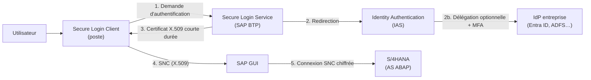
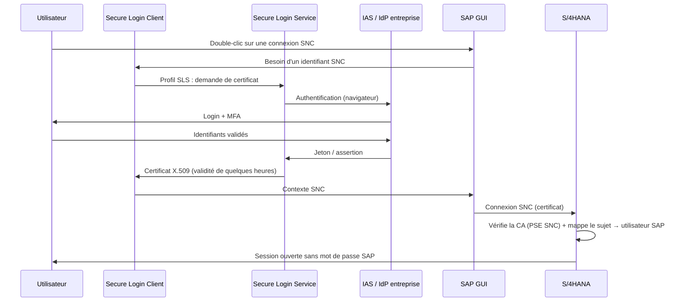

# SAP Secure Login Service & SAP Secure Login Client – SSO pour SAP GUI

> **Objet** : expliquer à quoi servent **SAP Secure Login Service for SAP GUI** (SLS) et **SAP Secure Login Client** (SLC), ce qui les distingue, comment ils fonctionnent ensemble, et comment mettre en place le Single Sign-On (SSO) SAP GUI vers un système ABAP (ex. S/4HANA).
> **Public** : architectes, Basis, sécurité, poste de travail.

> ⚠️ Les noms de rôles, d'écrans et de paramètres évoluent avec les versions du service cloud et du client. Vérifier la documentation SAP Help de *SAP Secure Login Service for SAP GUI* et de *SAP Single Sign-On* avant mise en œuvre.

---

## Sommaire

1. [En bref](#1-en-bref)
2. [Les composants](#2-les-composants)
3. [Différence et lien entre SLS et SLC](#3-différence-et-lien-entre-sls-et-slc)
4. [Les scénarios SSO possibles](#4-les-scénarios-sso-possibles)
5. [Fonctionnement du scénario SLS + SLC](#5-fonctionnement-du-scénario-sls--slc)
6. [Prérequis](#6-prérequis)
7. [Configuration côté SAP BTP et Identity Authentication](#7-configuration-côté-sap-btp-et-identity-authentication)
8. [Configuration de SAP Secure Login Service](#8-configuration-de-sap-secure-login-service)
9. [Configuration du système ABAP (SNC)](#9-configuration-du-système-abap-snc)
10. [Mapping des utilisateurs](#10-mapping-des-utilisateurs)
11. [Installation et configuration du Secure Login Client](#11-installation-et-configuration-du-secure-login-client)
12. [Configuration de SAP GUI / SAP Logon](#12-configuration-de-sap-gui--sap-logon)
13. [Tests et recette](#13-tests-et-recette)
14. [Dépannage](#14-dépannage)
15. [Annexes](#15-annexes)

---

## 1. En bref

| Question | Réponse courte |
|---|---|
| **Secure Login Client (SLC)** | Logiciel installé **sur le poste utilisateur**. Il fournit à SAP GUI la bibliothèque SNC et détient les identifiants de l'utilisateur (ticket Kerberos ou certificat X.509). |
| **Secure Login Service (SLS)** | **Service cloud SAP BTP**. Il authentifie l'utilisateur (via SAP Cloud Identity Services) puis lui **délivre un certificat X.509 de courte durée** pour la connexion SAP GUI. |
| Le lien | SLS est le **serveur** qui émet les certificats ; SLC est le **client** qui les demande, les stocke et les présente à SAP GUI. |
| Peut-on utiliser SLC sans SLS ? | **Oui** : avec Kerberos (Active Directory), avec une PKI existante (carte à puce, certificats Windows) ou avec un Secure Login Server on-premise. |
| Peut-on utiliser SLS sans SLC ? | **Non** pour SAP GUI : SLC est le composant qui reçoit et utilise le certificat sur le poste. |
| Que gagne-t-on ? | SSO SAP GUI, **MFA** via l'IdP, chiffrement **SNC** des flux SAP GUI, plus de mots de passe SAP à gérer pour les utilisateurs de dialogue. |

---

## 2. Les composants

### 2.1 SAP Secure Login Client (SLC)

- Application Windows (et macOS) faisant partie de la famille **SAP Single Sign-On 3.0**.
- Fournit la **bibliothèque SNC** (GSS-API) utilisée par SAP GUI.
- Gère plusieurs **profils** d'authentification :
  - **Kerberos** : réutilise le ticket de la session Windows (domaine AD) ;
  - **certificats Microsoft / carte à puce** : réutilise un certificat déjà présent sur le poste ;
  - **profils de type Secure Login Server / Secure Login Service** : obtient un certificat X.509 après authentification.
- Affiche dans sa console l'état de chaque profil (authentifié ou non, date d'expiration du certificat).
- Se déploie en masse (MSI, GPO, outils de télédistribution) et se configure par registre / stratégies de groupe.

<!-- 📸 CAPTURE 01 : Console Secure Login Client sur le poste – liste des profils (Kerberos, profil SLS…) -->

### 2.2 SAP Secure Login Service for SAP GUI (SLS)

- Service **SaaS sur SAP BTP** (abonnement dans un sous-compte).
- Fait office d'**autorité de certification** (CA SAP Cloud par défaut, ou **CA personnalisée** possible) pour des certificats utilisateurs de **courte durée**.
- **Délègue l'authentification** à **SAP Cloud Identity Services – Identity Authentication (IAS)**, qui peut lui-même déléguer à l'IdP de l'entreprise (Microsoft Entra ID, ADFS, Okta…) → MFA, accès conditionnel.
- Console d'administration : profils, durée de validité, règles de construction du sujet du certificat, groupes autorisés.
- Remplace, pour le scénario SAP GUI, le **Secure Login Server** on-premise (composant Java de SAP SSO 3.0), sans serveur à maintenir.

<!-- 📸 CAPTURE 02 : SAP BTP Cockpit – sous-compte avec l'abonnement SAP Secure Login Service for SAP GUI -->

### 2.3 Composants associés

| Composant | Rôle |
|---|---|
| **SAP Cloud Identity Services – Identity Authentication (IAS)** | IdP / proxy d'IdP utilisé par SLS pour authentifier l'utilisateur |
| **IdP d'entreprise** (Entra ID, ADFS…) | Source réelle de l'identité et de la MFA (optionnel mais recommandé) |
| **CommonCryptoLib** | Bibliothèque cryptographique SAP côté serveur ABAP, utilisée pour SNC |
| **SAP GUI for Windows / Java** | Client SAP qui utilise SNC via la bibliothèque fournie par SLC |
| **Secure Login Server** (on-prem) | Alternative on-premise à SLS (licence SAP SSO 3.0, AS Java) |

---

## 3. Différence et lien entre SLS et SLC

### 3.1 Comparatif

| Critère | Secure Login Client | Secure Login Service |
|---|---|---|
| Nature | Logiciel client | Service cloud (SaaS BTP) |
| Emplacement | Poste de travail utilisateur | SAP BTP (région choisie) |
| Fonction | Fournir SNC à SAP GUI, stocker et présenter les identifiants | Authentifier l'utilisateur et émettre un certificat X.509 |
| Utilisable seul | Oui (Kerberos, PKI existante, chiffrement seul) | Non (nécessite SLC côté poste) |
| Administration | Déploiement / GPO / registre | Console d'administration SLS + IAS |
| Maintenance | Mises à jour du client sur les postes | Gérée par SAP |
| Licence | Livré avec SAP SSO, SLS, ou utilisable pour le seul chiffrement SNC | Abonnement BTP |

### 3.2 Comment ils s'articulent

> Point clé : le **système ABAP ne contacte jamais le cloud**. Il fait seulement confiance à la CA qui a signé le certificat (import de la chaîne de certificats dans le PSE SNC) et mappe le sujet du certificat sur un utilisateur SAP.

---

## 4. Les scénarios SSO possibles

| Scénario | Composants | Avantages | Limites | Quand le choisir |
|---|---|---|---|---|
| **A. Kerberos** | SLC (profil Kerberos) + Active Directory + compte de service AD pour le système SAP | Pas de cloud, totalement transparent sur un poste joint au domaine | Poste joint au domaine AD obligatoire, pas de MFA, gestion SPN/keytab | Parc Windows homogène sur domaine, sans exigence MFA |
| **B. X.509 via SLS** | SLC + SLS + IAS (+ IdP entreprise) | MFA, accès conditionnel, postes hors domaine, pas de serveur à maintenir | Dépendance au cloud BTP, abonnement | **Cible recommandée** pour une stratégie cloud / Zero Trust |
| **C. X.509 via Secure Login Server** | SLC + Secure Login Server (AS Java on-prem) | Tout on-premise | Serveur Java à opérer, licence SAP SSO 3.0 | Contraintes fortes contre le cloud |
| **D. X.509 PKI existante** | SLC + certificats d'une PKI d'entreprise / carte à puce | Réutilise l'existant | Cycle de vie des certificats à gérer | PKI déjà industrialisée |
| **Chiffrement SNC seul (sans SSO)** | SLC + CommonCryptoLib | Chiffre les flux SAP GUI | Toujours user / mot de passe | Étape transitoire ou exigence de chiffrement seul |

> 💡 Le chiffrement SNC seul (sans SSO) peut être utilisé sans licence SSO dédiée : voir la note SAP **2440692**. Le SSO nécessite une licence (SAP SSO 3.0 ou abonnement SLS).

---

## 5. Fonctionnement du scénario SLS + SLC

- Le certificat est **éphémère** (durée configurable, typiquement une journée de travail) : pas de révocation à gérer.
- Tant que le certificat est valide, toutes les connexions SAP GUI SNC sont **sans saisie**.
- Le sujet du certificat contient un attribut de l'utilisateur (login name, e-mail, ID utilisateur…) défini dans le profil SLS, ainsi que des informations sur le tenant, par exemple :
  `CN=JDUPONT, L=<tenant>.accounts.ondemand.com, OU=…, OU=SAP BTP Clients, O=SAP SE, C=DE`

---

## 6. Prérequis

### 6.1 Organisation et licences

| Prérequis | Détail |
|---|---|
| Compte global SAP BTP | Avec un sous-compte dans la région souhaitée |
| Droit d'utilisation (entitlement) | *SAP Secure Login Service for SAP GUI* |
| Tenant IAS | SAP Cloud Identity Services – Identity Authentication (souvent déjà présent avec les licences cloud SAP) |
| IdP d'entreprise | Optionnel mais recommandé (Entra ID, ADFS…) pour la MFA et la source d'identité unique |
| Annuaire / attribut de mapping | Un attribut **stable et unique** reliant l'utilisateur IdP à l'utilisateur SAP (ex. login SAP stocké dans un attribut, ou e-mail) |

### 6.2 Poste de travail

| Prérequis | Détail |
|---|---|
| SAP GUI | Version maintenue (7.70 / 8.00, patch récent) |
| Secure Login Client | **3.0** avec un niveau de patch récent : les anciens niveaux peuvent ne pas récupérer les profils SLS |
| Navigateur | Navigateur par défaut fonctionnel (utilisé pour l'authentification IAS) |
| Réseau | Sortie HTTPS vers l'URL du tenant SLS et vers IAS / l'IdP (règles proxy) |
| Droits | Droits d'administration pour l'installation (ou télédistribution) |

### 6.3 Système ABAP

| Prérequis | Détail |
|---|---|
| CommonCryptoLib | Version récente sur tous les serveurs d'application (`sapgenpse` / `SM51` → infos bibliothèque) |
| PSE SNC | PSE SNC (SAPCryptolib) créé et valide |
| SNC | Paramètres SNC activés (voir §9) |
| Certificats | Chaîne de certificats de la CA SLS (racine + intermédiaire) disponible |
| Utilisateurs | Noms SNC renseignés ou règles de mapping définies |
| Réseau | **Aucun flux sortant requis** du système ABAP vers SLS |

### 6.4 Rôles et responsabilités

| Équipe | Responsabilités |
|---|---|
| Administrateur BTP | Abonnement SLS, role collections |
| Équipe IAM / sécurité | IAS, fédération avec l'IdP entreprise, MFA, attributs |
| Basis | SNC, PSE, paramètres de profil, mapping utilisateurs |
| Poste de travail | Packaging et déploiement de SLC et SAP GUI, GPO |

---

## 7. Configuration côté SAP BTP et Identity Authentication

### 7.1 Établir la confiance BTP ↔ IAS

1. BTP Cockpit → sous-compte → **Sécurité > Trust Configuration** → *Establish Trust* avec le tenant IAS.

<!-- 📸 CAPTURE 03 : BTP Cockpit – Trust Configuration avec le tenant IAS -->

### 7.2 Souscrire au service

1. **Entitlements** : ajouter *SAP Secure Login Service for SAP GUI* au sous-compte.
2. **Instances and Subscriptions** → *Create* → *SAP Secure Login Service for SAP GUI*.
3. À l'abonnement, une **application** correspondante est créée automatiquement dans le tenant IAS.

<!-- 📸 CAPTURE 04 : BTP Cockpit – Entitlement SLS ajouté au sous-compte -->

<!-- 📸 CAPTURE 05 : BTP Cockpit – Abonnement SLS au statut « Subscribed » -->

### 7.3 Attribuer les rôles d'administration

- **Role Collections** : attribuer la role collection d'administration de SLS aux administrateurs (nom exact visible après abonnement).

<!-- 📸 CAPTURE 06 : BTP Cockpit – Role collection d'administration SLS attribuée à un administrateur -->

### 7.4 Configurer l'application dans IAS

Console d'administration IAS → **Applications** → application SLS générée :

| Réglage | Recommandation |
|---|---|
| Subject Name Identifier | Attribut utilisé pour construire le sujet du certificat (ex. *Login Name* ou attribut personnalisé contenant l'ID SAP) |
| Authentification conditionnelle | Rediriger vers l'IdP d'entreprise (Entra ID…) |
| MFA | Imposée par l'IdP d'entreprise ou par IAS (*Risk-Based Authentication*) |
| Groupes | Créer un groupe (ex. `SLS_SAPGUI_USERS`) pour restreindre l'accès |

<!-- 📸 CAPTURE 07 : IAS – application SLS générée automatiquement (onglet Trust / Subject Name Identifier) -->

<!-- 📸 CAPTURE 08 : IAS – authentification conditionnelle vers l'IdP d'entreprise -->

<!-- 📸 CAPTURE 09 : IAS – groupe des utilisateurs autorisés à utiliser SLS -->

---

## 8. Configuration de SAP Secure Login Service

Ouvrir la **console d'administration SLS** (*Go to Application* depuis l'abonnement).

### 8.1 Récupérer l'URL du tenant

Elle sera configurée dans tous les Secure Login Client (format de type `https://<sous-domaine>.<région>.sls.cloud.sap`).

<!-- 📸 CAPTURE 10 : Console SLS – page d'accueil avec l'URL du tenant -->

### 8.2 Créer les profils

Un profil définit **comment le certificat est construit et à qui il est délivré**.

| Paramètre du profil | Recommandation |
|---|---|
| Nom | Explicite, ex. `SAPGUI-PROD`, `SAPGUI-NONPROD` |
| Durée de validité | Une journée de travail (ex. 8 à 12 h) |
| Construction du sujet | À partir de l'attribut IAS choisi (ID SAP ou e-mail) |
| Groupes autorisés | Groupe(s) IAS du §7.4 |

> Recommandation : **un profil pour la production et un profil pour les systèmes non productifs**, avec des groupes distincts. Cela permet d'ouvrir l'accès hors production plus largement sans l'étendre à la production.

<!-- 📸 CAPTURE 11 : Console SLS – liste des profils -->

<!-- 📸 CAPTURE 12 : Console SLS – détail d'un profil (validité, sujet, groupes) -->

### 8.3 Récupérer la chaîne de certificats

- Télécharger le **certificat racine** et le **certificat intermédiaire** de la CA qui signe les certificats utilisateurs.
- Par défaut, il s'agit de la CA SAP Cloud. Une **CA personnalisée** peut être configurée (onglet *Custom CA*) pour réutiliser la PKI de l'entreprise.

<!-- 📸 CAPTURE 13 : Console SLS – téléchargement des certificats de CA (ou onglet Custom CA) -->

---

## 9. Configuration du système ABAP (SNC)

> À réaliser sur **chaque système** (DEV, QUAL, PROD), en commençant par la DEV.

### 9.1 Vérifier CommonCryptoLib et le PSE SNC

1. Vérifier la version de CommonCryptoLib (`SM51` → *Release Notes* / infos bibliothèque, ou `sapgenpse` au niveau OS).
2. `STRUST` → **PSE SNC (SAPCryptolib)** : créer le PSE s'il n'existe pas, avec un nom distinctif du type :
   `CN=<SID>, OU=SAP, O=<Entreprise>, C=FR`
3. L'assistant **SNCWIZARD** (transaction `SNCWIZARD`) peut automatiser la création du PSE et des paramètres.

<!-- 📸 CAPTURE 14 : STRUST – PSE SNC (SAPCryptolib) avec le certificat propre du système -->

<!-- 📸 CAPTURE 15 : SNCWIZARD – écran de synthèse -->

### 9.2 Importer la chaîne de certificats SLS

`STRUST` → PSE SNC → *Importer certificat* → **Ajouter à la liste des certificats** (racine, puis intermédiaire) → *Sauvegarder*.

<!-- 📸 CAPTURE 16 : STRUST – liste des certificats du PSE SNC contenant les CA SLS -->

### 9.3 Paramètres de profil

Transaction `RZ10` (profil par défaut ou d'instance) :

| Paramètre | Valeur recommandée | Commentaire |
|---|---|---|
| `snc/enable` | `1` | Active SNC |
| `snc/gssapi_lib` | `$(DIR_EXECUTABLE)/libsapcrypto.so` (Linux) | Chemin de CommonCryptoLib |
| `snc/identity/as` | `p:CN=<SID>, OU=SAP, O=<Entreprise>, C=FR` | **Identique** au DN du PSE SNC |
| `snc/data_protection/max` | `3` | Chiffrement maximal |
| `snc/data_protection/min` | `2` | Minimum : intégrité |
| `snc/data_protection/use` | `3` | Chiffrement par défaut |
| `snc/accept_insecure_gui` | `U` en transition, puis `0` | `U` : logon user/mot de passe autorisé seulement pour les utilisateurs autorisés dans SU01 |
| `snc/accept_insecure_rfc` | `1` | À durcir après analyse des flux RFC |
| `snc/accept_insecure_cpic` | `1` | Idem |
| `snc/permit_insecure_start` | `1` | Programmes externes non SNC |
| `snc/extid_login_diag` | `1` | Nécessaire pour le **mapping par règles** (§10.2) |
| `login/certificate_mapping_rulebased` | `1` | Active le mapping par règles des certificats |

Redémarrer le système (ou les instances) après modification.

<!-- 📸 CAPTURE 17 : RZ10 / RZ11 – paramètres snc/* actifs -->

<!-- 📸 CAPTURE 18 : SM21 / trace dev_w0 – démarrage SNC réussi après redémarrage -->

---

## 10. Mapping des utilisateurs

Le système ABAP doit retrouver l'utilisateur SAP à partir du sujet du certificat.

### 10.1 Option 1 – Nom SNC dans SU01 (simple, unitaire)

`SU01` → onglet **SNC** → nom SNC = sujet complet du certificat préfixé par `p:`, par exemple :
`p:CN=JDUPONT, L=<tenant>.accounts.ondemand.com, OU=…, OU=SAP BTP Clients, O=SAP SE, C=DE`

Adapté aux tests et aux petits périmètres. Mise en masse possible avec `SU10` ou un programme.

<!-- 📸 CAPTURE 19 : SU01 – onglet SNC renseigné pour un utilisateur de test -->

### 10.2 Option 2 – Mapping par règles avec CERTRULE (recommandé)

Transaction **`CERTRULE`** :
1. Charger un **certificat exemple** émis par SLS (exporté depuis la console SLC).
2. Créer une règle : *attribut du sujet* (ex. `CN`) → **ID externe** ; filtrer sur la partie fixe du DN (tenant, OU).
3. Si le CN contient l'ID SAP, le mapping est **automatique**, sans maintenance par utilisateur.
4. Vérifier l'état du mapping dans l'écran de test de `CERTRULE`.

| Avantage | Point d'attention |
|---|---|
| Aucune maintenance unitaire | L'attribut source (IAS) doit contenir **exactement** l'ID utilisateur SAP |
| Gestion centralisée | Prévoir le traitement des exceptions (utilisateurs techniques, ID divergents) |

<!-- 📸 CAPTURE 20 : CERTRULE – certificat exemple chargé et règle de mapping CN → utilisateur -->

<!-- 📸 CAPTURE 21 : CERTRULE – résultat du test de mapping (utilisateur trouvé) -->

---

## 11. Installation et configuration du Secure Login Client

### 11.1 Installation

1. Télécharger SLC 3.0 (dernier niveau de patch) depuis le SAP Software Center.
2. Installer via MSI (silencieux possible) **après fermeture de SAP GUI**. Un redémarrage peut être nécessaire.
3. Importer le certificat racine SLS dans le magasin de confiance du poste si votre procédure l'exige (selon la CA utilisée).

<!-- 📸 CAPTURE 22 : Assistant d'installation SLC (ou paquet de télédistribution) -->

### 11.2 Configuration du profil SLS

**Manuellement (tests)** : console SLC → *Options / Préférences* → renseigner l'URL du tenant SLS → les profils sont récupérés automatiquement.

**En masse (production)** : déployer l'URL du tenant et les options via **stratégies de groupe (ADMX SLC)** ou clés de registre, pour qu'aucune action utilisateur ne soit nécessaire.

<!-- 📸 CAPTURE 23 : SLC – écran Options avec l'URL du tenant SLS -->

<!-- 📸 CAPTURE 24 : SLC – profils SLS récupérés (avant authentification) -->

<!-- 📸 CAPTURE 25 : GPO / registre – paramètres SLC déployés centralement -->

### 11.3 Première authentification

1. Ouvrir une connexion SAP GUI SNC (ou double-cliquer sur le profil dans SLC).
2. Une fenêtre de navigateur s'ouvre → authentification IAS / IdP entreprise (+ MFA).
3. Le profil passe à l'état **authentifié** ; le certificat et sa date d'expiration sont visibles.

<!-- 📸 CAPTURE 26 : Page d'authentification IAS / IdP entreprise ouverte par SLC (avec MFA) -->

<!-- 📸 CAPTURE 27 : SLC – profil authentifié avec certificat et date d'expiration -->

<!-- 📸 CAPTURE 28 : SLC – détail du certificat (sujet, émetteur, validité) -->

---

## 12. Configuration de SAP GUI / SAP Logon

Pour chaque entrée système (de préférence via un **fichier `SAPUILandscape.xml` centralisé**) :

| Champ | Valeur |
|---|---|
| Activer la communication réseau sécurisée (SNC) | ✅ |
| Nom SNC | `p:CN=<SID>, OU=SAP, O=<Entreprise>, C=FR` (identique à `snc/identity/as`) |
| Niveau de protection | Max. disponible |
| Ouverture de session SNC avec utilisateur / mot de passe | Décoché (SSO) |

<!-- 📸 CAPTURE 29 : SAP Logon – propriétés de connexion, onglet Réseau avec SNC activé -->

<!-- 📸 CAPTURE 30 : SAP Logon – icône de cadenas sur les entrées SNC -->

---

## 13. Tests et recette

| # | Test | Résultat attendu |
|---|---|---|
| 1 | Connexion SAP GUI sans certificat valide | Ouverture de l'authentification IAS / IdP |
| 2 | Authentification avec MFA | Certificat délivré, profil SLC authentifié |
| 3 | Connexion SAP GUI | Session ouverte **sans mot de passe** |
| 4 | Barre d'état SAP GUI | Cadenas fermé (SNC actif) |
| 5 | `SM04` / `STAD` | Utilisateur connecté avec type SNC |
| 6 | Utilisateur hors groupe IAS | Certificat refusé |
| 7 | Utilisateur sans mapping | Échec de connexion avec message SNC |
| 8 | Expiration du certificat | Nouvelle authentification demandée |
| 9 | Poste hors réseau d'entreprise (VPN / Internet) | Fonctionnement selon les règles d'accès conditionnel |
| 10 | Logon user / mot de passe (si `snc/accept_insecure_gui=U`) | Autorisé uniquement pour les utilisateurs exemptés |

<!-- 📸 CAPTURE 31 : SAP GUI – session ouverte avec cadenas fermé dans la barre d'état -->

<!-- 📸 CAPTURE 32 : SM04 – utilisateur connecté via SNC -->

---

## 14. Dépannage

| Symptôme | Cause probable | Action |
|---|---|---|
| SLC ne récupère pas les profils | URL erronée, proxy, version SLC trop ancienne | Vérifier l'URL, le proxy, mettre à jour SLC |
| Le navigateur ne s'ouvre pas | Navigateur par défaut, stratégie de sécurité | Vérifier le navigateur par défaut et les GPO |
| Accès refusé après MFA | Utilisateur absent du groupe autorisé | Ajouter l'utilisateur au groupe IAS du profil |
| Erreur SNC « nom SNC inconnu / pas de mapping » | Pas de nom SNC dans SU01 ou règle CERTRULE incorrecte | Comparer le sujet du certificat avec SU01 / CERTRULE |
| Erreur « certificat non approuvé » | CA SLS absente du PSE SNC | Réimporter la racine et l'intermédiaire dans STRUST (PSE SNC) |
| Erreur de nom SNC du partenaire | Nom SNC SAP Logon ≠ `snc/identity/as` | Aligner les deux valeurs |
| SNC ne démarre pas | Mauvais `snc/gssapi_lib`, PSE absent | Vérifier la trace `dev_w0` et SM21 |
| Fonctionne en DEV mais pas en QUAL | Configuration non reproduite (PSE, CERTRULE, paramètres) | Dérouler la check-list §15.1 sur chaque système |

Outils de diagnostic :
- **SLC** : traces activables depuis la console / le registre.
- **ABAP** : `ST11` (traces `dev_w*`), `SM21`, `SM20` / `RSAU_READ_LOG` (audit de sécurité), `CERTRULE` (test de mapping).
- **IAS** : journaux de troubleshooting de l'application.

<!-- 📸 CAPTURE 33 : ST11 – trace dev_w avec une erreur SNC typique -->

---

## 15. Annexes

### 15.1 Check-list de mise en œuvre

| # | Étape | DEV | QUAL | PROD |
|---|---|---|---|---|
| 1 | Trust BTP ↔ IAS | ☐ | — | — |
| 2 | Abonnement SLS + role collections | ☐ | — | — |
| 3 | Application IAS, fédération IdP, MFA, groupes | ☐ | — | — |
| 4 | Profils SLS (non-prod / prod) | ☐ | — | — |
| 5 | CommonCryptoLib à jour | ☐ | ☐ | ☐ |
| 6 | PSE SNC + import CA SLS | ☐ | ☐ | ☐ |
| 7 | Paramètres `snc/*` + redémarrage | ☐ | ☐ | ☐ |
| 8 | Mapping utilisateurs (SU01 / CERTRULE) | ☐ | ☐ | ☐ |
| 9 | SLC déployé et configuré | ☐ | ☐ | ☐ |
| 10 | SAP Logon configuré (SNC) | ☐ | ☐ | ☐ |
| 11 | Recette §13 | ☐ | ☐ | ☐ |
| 12 | Durcissement `snc/accept_insecure_gui = 0` | ☐ | ☐ | ☐ |

### 15.2 Glossaire

| Terme | Définition |
|---|---|
| **SNC** | Secure Network Communications : couche SAP de sécurisation (authentification, intégrité, chiffrement) des flux DIAG/RFC |
| **GSS-API** | Interface standard utilisée par SNC pour déléguer la sécurité à une bibliothèque externe |
| **PSE** | Personal Security Environment : magasin de clés et certificats SAP |
| **CommonCryptoLib** | Bibliothèque cryptographique SAP côté serveur |
| **IAS** | SAP Cloud Identity Services – Identity Authentication |
| **CERTRULE** | Transaction de mapping par règles des certificats vers les utilisateurs ABAP |
| **MFA** | Authentification multifacteur |

### 15.3 Références

- SAP Help Portal – *SAP Secure Login Service for SAP GUI*
- SAP Help Portal – *SAP Single Sign-On 3.0* (Secure Login Client)
- SAP Help Portal – *SNC* et *Single Sign-On with Client Certificates* (AS ABAP)
- Note SAP **2440692** – chiffrement SNC client sans licence SSO
- Note SAP **1848999** – CommonCryptoLib
- SAP Community – topic page *SAP Secure Login Service for SAP GUI*

### 15.4 Index des captures d'écran

| N° | Système / outil | Contenu |
|---|---|---|
| 01 | Poste | Console SLC |
| 02–06 | BTP | Abonnement, trust, entitlement, role collection |
| 07–09 | IAS | Application, auth conditionnelle, groupe |
| 10–13 | Console SLS | URL tenant, profils, certificats CA |
| 14–18 | ABAP | PSE SNC, SNCWIZARD, CA, paramètres, démarrage SNC |
| 19–21 | ABAP | SU01 SNC, CERTRULE |
| 22–28 | Poste | Installation et authentification SLC |
| 29–30 | Poste | SAP Logon SNC |
| 31–33 | ABAP / SAP GUI | Session SSO, SM04, trace d'erreur |
