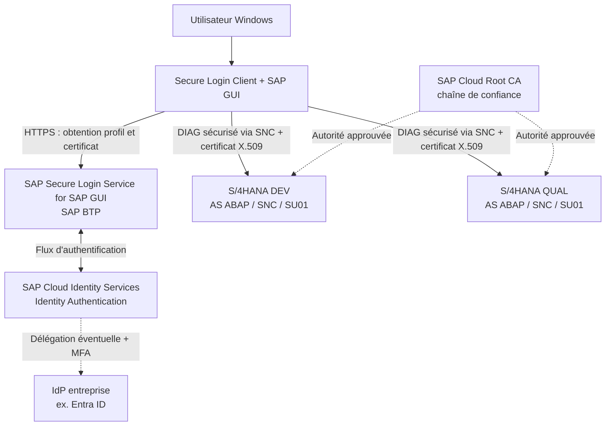
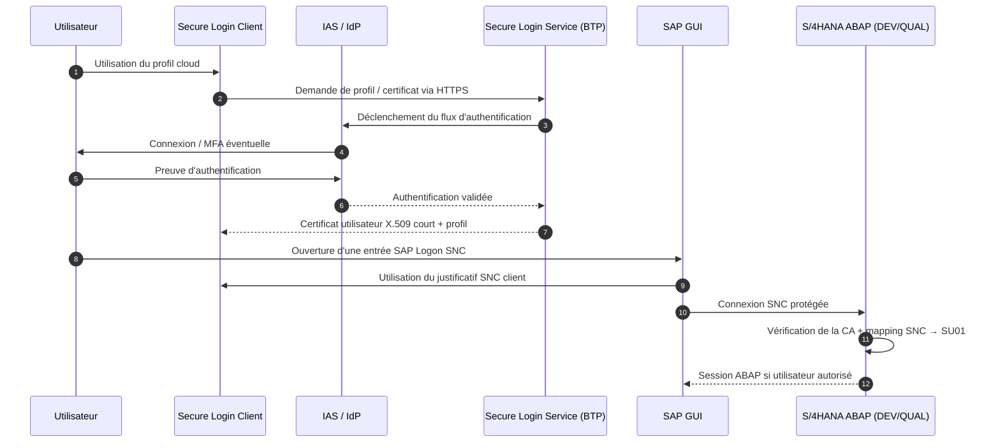

# Guide d'architecture, d'installation et d'utilisation — SAP Secure Login Service & SAP Secure Login Client

> **Contexte :** SAP S/4HANA 2021 FPS02 — systèmes DEV et QUAL  
> **Technologies :** SAP Secure Login Service for SAP GUI (cloud), SAP Secure Login Client (Windows), SAP Cloud Identity Services – Identity Authentication (IAS), X.509, SNC, SAP GUI  
> **Public :** équipes SAP Basis, sécurité/IAM, réseau, poste de travail et support  
> **Version du document :** 1.0 — 9 octobre 2026  
> **Statut :** modèle d'implémentation à compléter avec les paramètres et captures du paysage réel

---

## 1. Objectifs et périmètre

Ce document vise à :

1. expliquer **l'utilité et les différences** entre SAP Secure Login **Service**, SAP Secure Login **Client** et l'ancien SAP Secure Login **Server** ;
2. montrer **comment les composants interagissent** pour permettre le Single Sign-On (SSO) de **SAP GUI for Windows** ;
3. documenter les **prérequis techniques et organisationnels** ;
4. fournir une **procédure d'installation et de configuration**, du cloud SAP BTP jusqu'aux utilisateurs ABAP ;
5. définir une **méthode de test DEV puis QUAL**, les contrôles de sécurité et le dépannage ;
6. réserver des **emplacements de captures d'écran** à renseigner sur le système réel.

**Périmètre retenu :** DEV et QUAL de SAP S/4HANA 2021 FPS02 ; PROD peut exister dans le landscape, mais **n'est pas configuré ni illustré dans ce guide**.

> **Attention :** les interfaces BTP/IAS, les options du Secure Login Client et les corrections SAP évoluent. Vérifier la documentation SAP, les SAP Notes applicables, les versions installées et les droits de licence avant toute action. Les exemples de SID, CN, DNS et de profils ci-dessous sont **fictifs**.

<!-- CAPTURE E01 — Insérer une vue synthétique du paysage DEV/QUAL (diagramme d'architecture, sans secrets). Chemin suggéré : captures/01_landscape_dev_qual.png -->

---

## 2. Comprendre les composants : quelles différences ?

### 2.1 SAP Secure Login Service for SAP GUI (SLS)

**SAP Secure Login Service for SAP GUI** est un **service cloud** consommé via SAP BTP. Associé à **SAP Cloud Identity Services – Identity Authentication (IAS)** et éventuellement à un fournisseur d'identités d'entreprise (Microsoft Entra ID, par exemple), il permet de délivrer aux clients utilisateurs des **certificats X.509 de courte durée** après une authentification pouvant comporter une MFA. Il fournit aussi les paramètres/profils utilisés par les postes clients.

**Son rôle :** centraliser et sécuriser le processus d'obtention des identités utilisables pour le SSO SAP GUI, sans déployer un nouveau serveur Secure Login Server dans le datacenter.

Il **ne remplace pas** SAP GUI, **ne remplace pas** les utilisateurs SAP dans `SU01`, et **n'ouvre pas** directement une session DIAG/SNC sur S/4HANA à la place du poste.

### 2.2 SAP Secure Login Client (SLC)

**SAP Secure Login Client** est un **logiciel installé sur le poste Windows**. Il présente à SAP GUI des justificatifs de sécurité (certificats X.509 ou tickets Kerberos suivant le scénario) et permet l'utilisation de SNC côté client.

Dans le scénario cloud étudié, il interagit avec le Secure Login Service pour obtenir le certificat X.509 lié à l'identité authentifiée ; SAP GUI utilise ensuite ce certificat lors de la connexion SNC vers S/4HANA.

**Son rôle :** faire le pont, sur le poste utilisateur, entre l'identité/authentification et la connexion sécurisée SAP GUI.

### 2.3 SAP Secure Login Server (SLS on-premise historique)

**SAP Secure Login Server** est un composant **serveur on-premise**, historiquement livré avec **SAP Single Sign-On 3.0**, reposant sur une infrastructure SAP NetWeaver AS Java. Il ne faut pas le confondre avec le **SAP Secure Login Service for SAP GUI**, qui est cloud.

Si une installation historique existe, le guide SAP de migration prévoit notamment le remplacement des profils SLC et de la chaîne d'autorité de certification côté ABAP.

### 2.4 IAS, SNC et SAP Cryptographic Library

- **IAS** (Identity Authentication) : service d'authentification SAP Cloud Identity Services ; peut déléguer l'authentification à l'IdP d'entreprise et appliquer des politiques MFA.
- **IdP d'entreprise** : source d'authentification (ex. Entra ID) ; peut imposer une MFA, des règles de conformité du poste ou des restrictions d'accès.
- **SNC** (*Secure Network Communications*) : mécanisme qui sécurise la communication entre **SAP GUI** et l'**Application Server ABAP**, et transporte l'authentification SSO.
- **SAP Cryptographic Library / CommonCryptoLib** : composant cryptographique utilisé sur AS ABAP pour SNC et la gestion des certificats.
- **STRUST** : transaction de gestion des certificats/PSE, notamment le PSE **SNC SAPCryptolib**.
- **SU01** : transaction de maintenance utilisateur ABAP ; le **nom SNC** du compte doit correspondre à l'identité portée par le certificat client.

### 2.5 Tableau comparatif

| Critère | Secure Login Service **cloud** | Secure Login Client | Secure Login Server **on-premise** |
|---|---|---|---|
| Emplacement | SAP BTP / service SAP | Poste utilisateur Windows | Infrastructure AS Java historique |
| Fonction | Service d'authentification / émission de certificats et profils | Utilisation des justificatifs, SNC côté poste | Émission et gestion centrale historique de certificats/profils |
| Fournit SAP GUI ? | Non | Non | Non |
| S'installe sur le poste ? | Non | **Oui** | Non |
| Nécessite IAS pour le scénario cloud documenté ? | **Oui** | Via le flux de service cloud | Pas nécessairement, dépend de l'architecture historique |
| Certificats X.509 | Fourniture cloud de certificats courts | Réception/utilisation | Émission on-premise historique |
| Principal usage ici | SSO SAP GUI par certificats + MFA amont | Agent côté utilisateur | Uniquement migration/comparaison |

**À retenir :** **Service = côté cloud ; Client = côté poste ; SNC = côté communication SAP GUI ↔ S/4HANA ; IAS/IdP = authentification préalable**.

<!-- CAPTURE E02 — Capture de la souscription SAP BTP « Secure Login Service for SAP GUI ». Chemin suggéré : captures/02_btp_service.png -->
<!-- CAPTURE E03 — Capture de l'application SAP Secure Login Client sur Windows montrant son profil (masquer les informations sensibles). Chemin suggéré : captures/03_secure_login_client.png -->

**Sources SAP :** [présentation de la solution](https://www.sap.com/products/financial-management/secure-login-service-for-gui.html), [Basic Scenarios](https://help.sap.com/docs/SAP%20SECURE%20LOGIN%20SERVICE/c35917ca71e941c5a97a11d2c55dcacd/25e380c278cf4ec3a9298eda089387de.html), [migration depuis SAP Single Sign-On](https://help.sap.com/docs/SAP%20SECURE%20LOGIN%20SERVICE/c35917ca71e941c5a97a11d2c55dcacd/bd28a94ee69c4c8d8be876044f73abe2.html).

---

## 3. Quel est le but du SSO dans SAP GUI ?

Sans SSO, l'utilisateur ouvre SAP GUI, sélectionne le système, puis saisit en général son identifiant et son mot de passe SAP. Avec le scénario **SLS cloud + SLC + SNC**, l'identité est validée en amont et SAP GUI peut ouvrir la session ABAP **sans demander à nouveau le mot de passe SAP** lorsque les conditions sont réunies.

**Bénéfices :**

- moins de mots de passe à saisir et moins de tickets de réinitialisation ;
- possibilité d'utiliser la MFA et les politiques d'accès conditionnel sur le parcours d'obtention du certificat ;
- certificat utilisateur **à durée de vie limitée** ;
- chiffrement et authentification de la connexion SAP GUI ↔ AS ABAP avec SNC ;
- centralisation du parcours d'authentification tout en conservant les rôles/autorisation métiers ABAP existants.

**Limites importantes :**

- SSO ≠ absence totale de toute interaction : une authentification et/ou MFA peut être demandée lors de la délivrance ou du renouvellement du certificat ;
- SSO ≠ autorisation métier : `PFCG` et les rôles ABAP restent actifs ;
- SLS/SLC pour **SAP GUI** ne configure **pas automatiquement** le SSO du **Fiori Launchpad** en navigateur. Fiori requiert sa propre configuration d'authentification HTTP/IdP ;
- ce dispositif n'apporte pas à lui seul de connectivité réseau : la machine doit toujours pouvoir atteindre les systèmes SAP DEV et QUAL.

---

## 4. Architecture de référence recommandée pour DEV et QUAL

### 4.1 Recommandation

Pour ce paysage, privilégier **SAP Secure Login Service for SAP GUI + IAS + SLC + certificats X.509 + SNC** afin de disposer d'un mécanisme cohérent de SSO pour DEV et QUAL. L'IdP d'entreprise reste optionnel mais recommandé si un annuaire/SSO/MFA central existe déjà.



> **Lecture du schéma :** le service cloud et IAS participent à l'authentification **et à l'obtention du certificat**. La connexion SAP GUI vers les serveurs **ne passe pas par SAP BTP** : elle emprunte le réseau habituel du poste vers les systèmes ABAP, via SNC.

Pour ce **cas d'usage**, **SAP Cloud Connector n'est pas intrinsèquement requis**. On ne l'ajoute que si un autre flux/une autre architecture en a réellement besoin.

<!-- CAPTURE E04 — Remplacer ou compléter le diagramme par un schéma d'architecture validé, avec les flux HTTPS et SNC, sans révéler les IP sensibles. Chemin suggéré : captures/04_architecture_sso.png -->

### 4.2 Un ou deux services/tenants ?

**Option simple pour démarrer :** un abonnement/service cloud et une stratégie d'identité communs pour les utilisateurs DEV et QUAL, avec **deux systèmes ABAP distincts** et chacun son propre PSE SNC / configuration SNC / comptes SAP. Le certificat utilisateur peut être reconnu par les deux systèmes **si leurs règles de confiance et mappings SNC sont configurés de façon cohérente**.

**Option séparation renforcée :** séparer les sous-comptes/tenants et politiques si exigé par la sécurité (frontières administratives, populations, conformité). Cette décision doit être prise **avant** la généralisation, car elle influence les suffixes de noms SNC et les politiques de déploiement.

| Composant | DEV | QUAL | Recommandation |
|---|---|---|---|
| SAP GUI / SLC | Poste pilote Windows | Même poste pilote possible | Client à jour, profil SLS géré |
| SAP BTP / SLS | Service commun possible | Service commun possible | Mutualiser pour POC, isoler si exigence sécurité |
| IAS / IdP | Identité centralisée | Identité centralisée | Identifiant utilisateur stable |
| S/4HANA ABAP | SNC activé, PSE et confiance | SNC activé, PSE et confiance | Paramétrage propre à chaque SID |
| Utilisateur ABAP | `SU01` + nom SNC | `SU01` + nom SNC | Mapping sans ambiguïté |
| Entrée SAP Logon | SNC activé vers DEV | SNC activé vers QUAL | SNC partner name propre à chaque système |

### 4.3 Paramètres à compléter

| Élément | DEV | QUAL |
|---|---|---|
| SID | `S4D` *(exemple)* | `S4Q` *(exemple)* |
| Mandant SAP | `___` | `___` |
| Host / message server | `___` | `___` |
| Nom SNC du serveur (`snc/identity/as`) | `___` | `___` |
| PSE SNC du serveur / date d'expiration | `___` | `___` |
| CA approuvée (empreinte / fin de validité) | `___` | `___` |
| Utilisateur pilote SAP | `___` | `___` |
| Nom SNC utilisateur `SU01` | `___` | `___` |

Configuration partagée :

| Élément | Valeur à renseigner |
|---|---|
| Sous-compte SAP BTP | `___` |
| Région SAP BTP | `___` |
| URL de tenant SLS / **Client Policy Groups Host** | `___` |
| URL du tenant IAS | `___` |
| IdP entreprise retenu | `___` |
| Attribut stable identifiant les utilisateurs (CN) | `___` |
| Politique MFA | `___` |
| Version/patch SAP GUI for Windows | `___` |
| Version/patch Secure Login Client | `___` |

---

## 5. Prérequis SSO : checklist avant installation

### 5.1 Licence, comptes et administration cloud

- [ ] **Licence propre au SAP Secure Login Service for SAP GUI cloud** et droit d'usage confirmé (distinct de la licence de l'ancienne solution SAP Single Sign-On on-premise).
- [ ] Global Account et sous-compte SAP BTP adaptés, dans une **région où le service est disponible**.
- [ ] Entitlement / quota visible pour le service puis souscription autorisée.
- [ ] Tenant **SAP Cloud Identity Services – Identity Authentication** disponible ; accès administrateur IAS.
- [ ] Trust configuré **BTP ↔ IAS**.
- [ ] Décision d'usage d'un IdP d'entreprise et politique MFA.
- [ ] Accès administrateur au service (rôles/collections selon l'abonnement réel).

**Bonne pratique pour les rôles :** réserver `SecureLoginServiceAdministrator` aux administrateurs de la solution et `SecureLoginServiceViewer` aux personnes ayant réellement besoin de consulter la configuration (vérifier les rôles effectivement proposés par le tenant).

<!-- CAPTURE P01 — Sous-compte BTP : Entitlements, Secure Login Service disponible. Chemin suggéré : captures/05_btp_entitlements.png -->
<!-- CAPTURE P02 — BTP : trust avec IAS (masquer données confidentielles). Chemin suggéré : captures/06_btp_trust_ias.png -->
<!-- CAPTURE P03 — IAS : application du Secure Login Service et politiques d'authentification. Chemin suggéré : captures/07_ias_application.png -->

### 5.2 Réseau et poste utilisateur

- [ ] SAP GUI **for Windows** compatible, version et patch validés avec la matrice SAP.
- [ ] **Secure Login Client** compatible avec le service cloud : **au minimum 3.0 SP2 patch 16** selon le guide SAP de migration ; installer de préférence un **correctif encore supporté** et validé par SAP.
- [ ] Droits d'installation Windows ou déploiement par outil d'entreprise (Intune, SCCM, etc.).
- [ ] Navigateur compatible avec le flux d'authentification IAS/IdP ; heure système synchronisée.
- [ ] Accès **HTTPS** du poste aux URLs nécessaires (SLS, IAS, IdP, éventuels endpoints de vérification de certificats), via proxy selon politique IT.
- [ ] Accès du poste au système S/4HANA en réseau SAP GUI (application server ou message server ; règles pare-feu définies par Basis/réseau).
- [ ] Certificats TLS d'infrastructure et chaîne de confiance vérifiés sur le poste ; aucune désactivation des contrôles TLS.
- [ ] Stratégie de gestion des postes mutualisés / VDI / Citrix et des profils utilisateurs définie.

### 5.3 Préparation ABAP / Basis (sur DEV puis QUAL)

- [ ] Application Server ABAP S/4HANA 2021 FPS02 opérationnel avec une version appropriée de **SAP CommonCryptoLib**.
- [ ] Accès aux transactions `STRUST`, `SNCWIZARD`, `SNCCONFIG`, `RZ10`, `RZ11`, `SU01` et aux outils de journalisation avec autorisations adaptées.
- [ ] PSE **SNC SAPCryptolib** créé/validé ; certificat du serveur cohérent avec son `snc/identity/as`.
- [ ] Chaîne de certification de **SAP Cloud Root CA** importée côté SNC du serveur pour faire confiance aux certificats clients fournis par SLS.
- [ ] **Plan de mapping utilisateur** défini : identité IAS → CN du certificat → DN/SNC → utilisateur `SU01`.
- [ ] Inventaire d'éventuelles configurations Kerberos ou SNC existantes, pour éviter de les perturber.
- [ ] Possibilité de redémarrer les instances ABAP si les paramètres de profil le demandent, avec fenêtre de changement autorisée.
- [ ] Accès de secours fonctionnel et documenté **avant** toute réduction des connexions non-SNC.

> **Point critique :** on peut avoir un certificat valide et un SNC techniquement fonctionnel, mais un **SSO impossible si le nom SNC du certificat client ne correspond pas à `SU01`**.

**Sources SAP :** [Prerequisites](https://help.sap.com/docs/SAP%20SECURE%20LOGIN%20SERVICE/c35917ca71e941c5a97a11d2c55dcacd/411f23fa904d4ff7bf2d4594a0b7f651.html), [installation SLC](https://help.sap.com/docs/SAP%20SECURE%20LOGIN%20SERVICE/c35917ca71e941c5a97a11d2c55dcacd/471161840a314a1f95df7e8ab886b4f5.html), [migration et version SLC minimum](https://help.sap.com/docs/SAP%20SECURE%20LOGIN%20SERVICE/c35917ca71e941c5a97a11d2c55dcacd/bd28a94ee69c4c8d8be876044f73abe2.html).

---

## 6. Installation et configuration : service cloud SAP BTP / IAS

### Étape 1 — Activer le service dans SAP BTP

1. Ouvrir le **SAP BTP Cockpit**, sélectionner le Global Account puis le sous-compte destiné au SLS.
2. Vérifier **Entitlements** : le service et son plan doivent être disponibles pour ce sous-compte.
3. Vérifier/établir le trust **Security → Trust Configuration → Establish Trust**, en choisissant le tenant IAS approprié.
4. Dans **Services** (Service Marketplace ou Instances and Subscriptions selon la version d'interface), **souscrire** au *SAP Secure Login Service for SAP GUI*.
5. Attribuer les **role collections** requises aux administrateurs et, si besoin, aux personnes de support.
6. Ouvrir l'application de configuration du service et relever son **URL de tenant**.

**Critère de validation :** un administrateur autorisé peut accéder à la console du Secure Login Service ; le service et le tenant IAS associés sont identifiés sans ambiguïté.

<!-- CAPTURE C01 — BTP : sous-compte sélectionné + abonnement SLS actif. Chemin suggéré : captures/08_btp_subscription.png -->
<!-- CAPTURE C02 — BTP : rôles/role collections du SLS, sans données personnelles. Chemin suggéré : captures/09_btp_role_collections.png -->

### Étape 2 — Configurer l'identité dans IAS

1. Ouvrir **SAP Cloud Identity Services** → tenant IAS concerné.
2. Dans **Applications & Resources → Applications**, sélectionner l'application du **Secure Login Service** associée à la souscription (vérifier les applications préconfigurées/bundled).
3. Définir la source de l'authentification : IAS directement ou **IdP d'entreprise** fédéré.
4. Configurer les politiques : **MFA**, accès par groupe, authentification conditionnelle si prévue par la solution IdP/IAS.
5. Choisir **l'attribut stable et unique** qui sera utilisé dans l'identité du certificat client : identifiant interne immuable si possible, ou adresse e-mail seulement si le processus de changement d'e-mail et l'unicité sont maîtrisés.
6. Contrôler les attributs/identifiants envoyés à l'application, dont le **Subject Name Identifier** et, le cas échéant, l'attribut de personnalisation `sls_common_name`.
7. Effectuer un test d'authentification IAS/IdP avec un utilisateur pilote.

> **Pourquoi le choix du CN est important :** le service utilise par défaut le **Subject Name Identifier** comme **Common Name (CN)** dans les certificats demandés ; l'attribut `sls_common_name` peut servir d'alternative selon la configuration. Une collision d'identité serait un **risque de sécurité majeur**. Valider l'unicité et la stabilité avant le premier mapping SAP.

**Exemple uniquement (à ne pas copier automatiquement) :** `CN=prenom.nom@entreprise.example` peut fonctionner, mais un identifiant RH ou IAM stable et unique est souvent plus robuste si les e-mails évoluent.

<!-- CAPTURE C03 — IAS : application SLS et sélection de l'IdP. Chemin suggéré : captures/10_ias_idp.png -->
<!-- CAPTURE C04 — IAS : Subject Name Identifier / attribut CN ; masquer tout PII. Chemin suggéré : captures/11_ias_subject_identifier.png -->
<!-- CAPTURE C05 — IAS/IdP : règle MFA/accès conditionnel (sans secrets). Chemin suggéré : captures/12_ias_mfa.png -->

### Étape 3 — Définir le profil Secure Login Client dans SLS

1. Dans la console d'administration du service, ouvrir la partie **Secure Login Client**.
2. Relever le champ **Client Policy Groups Host** (URL de base du tenant SLS) : il servira au rattachement du client et au déploiement des politiques.
3. Relever le **SNC User Name Suffix** généré par le service.
4. Préparer une politique de déploiement SLC pour les postes pilotes, en ciblant les systèmes DEV et QUAL, **sans écraser** les profils Kerberos déjà en service.
5. Faire valider le paramétrage par IAM et Basis avant de le déployer en masse.

**Exemple de forme d'identité client, non contractuel et propre au tenant :**

```text
p:CN=<identifiant_unique>, L=<tenant-ias>, OU=<region-sls>, OU=SAP BTP Clients, O=SAP SE, C=DE
```

Le **suffixe exact** se récupère dans la console du **tenant réel**. Ne pas réutiliser le suffixe d'un tutoriel ou d'une autre région.

<!-- CAPTURE C06 — Console SLS : « Client Policy Groups Host ». Chemin suggéré : captures/13_sls_client_policy_host.png -->
<!-- CAPTURE C07 — Console SLS : « SNC User Name Suffix ». Chemin suggéré : captures/14_sls_snc_suffix.png -->

**Sources SAP :** [configuration BTP ↔ IAS](https://help.sap.com/docs/SAP%20SECURE%20LOGIN%20SERVICE/c35917ca71e941c5a97a11d2c55dcacd/bd38e9deab2743aa8a3fb8aaa5b12210.html), [Secure Login Client – paramètres du tenant](https://help.sap.com/docs/SAP%20SECURE%20LOGIN%20SERVICE/c35917ca71e941c5a97a11d2c55dcacd/73ad154d35bc4c7b90e0ab283945650d.html), [SAP BTP Security Recommendations](https://help.sap.com/docs/btp/sap-btp-security-recommendations-c8a9bb59fe624f0981efa0eff2497d7d/sap-btp-security-recommendations?seclist-service=Identity+Provisioning).

---

## 7. Configuration de S/4HANA DEV : SNC, certificats et utilisateur

> **Ne commencer que sur DEV.** Sauvegarder les valeurs actuelles des profils SAP et du PSE SNC, préparer le retour arrière et conserver une procédure d'accès administrateur en cas de problème d'authentification.

### Étape 4 — Vérifier et préparer le SNC PSE avec `STRUST`

1. Se connecter à **DEV** avec un utilisateur Basis autorisé.
2. Ouvrir la transaction **`STRUST`**.
3. Sélectionner **SNC SAPCryptolib** et vérifier le PSE existant (sinon, le créer selon la procédure SAP et votre politique PKI).
4. Vérifier **propriétaire/Subject, émetteur, échéance et chaîne** du certificat du serveur.
5. S'assurer que le certificat du serveur est cohérent avec la future valeur `snc/identity/as`.
6. Télécharger la **SAP Cloud Root CA** depuis une **source officielle SAP Trust Center**, comparer son empreinte à la référence publiée et l'**ajouter à la Certificate List du PSE SNC SAPCryptolib**.
7. Sauvegarder et contrôler la liste de confiance.

**Deux confiances différentes sont à distinguer :**

- le serveur ABAP doit faire confiance à la **CA qui a délivré le certificat utilisateur SLS** ;
- le poste SLC doit pouvoir **authentifier le serveur SNC** et vérifier la confiance de la chaîne nécessaire au client, conformément à la procédure SAP.

Ne pas importer de clé privée sur les postes. Ne pas exporter/partager des PSE avec clé privée dans la documentation.

<!-- CAPTURE S01 — DEV / STRUST : PSE « SNC SAPCryptolib », certificat serveur (masquer zones sensibles). Chemin suggéré : captures/15_dev_strust_pse.png -->
<!-- CAPTURE S02 — DEV / STRUST : liste de confiance incluant « SAP Cloud Root CA ». Chemin suggéré : captures/16_dev_strust_root_ca.png -->

### Étape 5 — Configurer SNC dans DEV

La procédure recommandée est d'utiliser **`SNCWIZARD`** si elle est disponible, puis **`SNCCONFIG`** et `RZ10`/`RZ11` pour la vérification. Les paramètres dépendent de l'architecture : documenter l'existant avant modification.

| Paramètre ABAP | Objet | Exemple / contrôle |
|---|---|---|
| `snc/enable` | Activer SNC | `1` |
| `snc/gssapi_lib` | Bibliothèque cryptographique SNC | chemin SAP CommonCryptoLib fourni par SAP, par exemple `$(DIR_EXECUTABLE)$(DIR_SEP)$(FT_DLL_PREFIX)sapcrypto$(FT_DLL)` |
| `snc/identity/as` | Nom SNC du **serveur** | `p:<DN exact du certificat SNC serveur>` |
| `snc/data_protection/min` | Protection minimale | à paramétrer selon recommandations SAP (exemple SAP : `2`) |
| `snc/data_protection/use` | Protection par défaut | à paramétrer selon recommandations SAP (exemple SAP : `3`) |
| `snc/data_protection/max` | Protection maximale | à paramétrer selon recommandations SAP (exemple SAP : `3`) |
| `snc/accept_insecure_gui` | Accepter ou refuser les sessions GUI non-SNC | **`1` temporairement pendant pilote**, puis réévaluer `0` ou `U` après validation et plan de secours |

**Procédure de contrôle :**

1. Exécuter `SNCWIZARD` si disponible et appliquer uniquement les éléments adaptés à DEV.
2. Vérifier/compléter les paramètres dans `RZ10` selon les instructions SAP.
3. Planifier un **redémarrage** si le paramètre le nécessite ; vérifier les valeurs **effectives** avec `RZ11`.
4. Vérifier l'état SNC avec `SNCCONFIG`.
5. Confirmer que le nom SNC serveur correspond **exactement** au certificat SNC présenté par DEV.

> **Ne pas imposer immédiatement** `snc/accept_insecure_gui=0` à tous les utilisateurs. Durant le pilote, garder un chemin de dépannage approuvé. Le durcissement ne vient qu'après démonstration d'un SSO fonctionnel et approbation de l'équipe sécurité.

<!-- CAPTURE S03 — DEV / SNCWIZARD : activation et paramètres (avant/après). Chemin suggéré : captures/17_dev_sncwizard.png -->
<!-- CAPTURE S04 — DEV / RZ10/RZ11 : paramètres SNC, sans informations secrètes. Chemin suggéré : captures/18_dev_snccfg.png -->
<!-- CAPTURE S05 — DEV / SNCCONFIG : état SNC et contrôles. Chemin suggéré : captures/19_dev_sncconfig.png -->

### Étape 6 — Mapper l'utilisateur du certificat à l'utilisateur ABAP (`SU01`)

Pour chaque utilisateur pilote :

1. Identifier le **DN exact** du certificat X.509 délivré par SLS au poste pilote.
2. Dans **DEV → `SU01`**, ouvrir l'utilisateur SAP correspondant.
3. Dans la section SNC, renseigner le **nom SNC** avec le format `p:<DN complet du certificat utilisateur>`.
4. Enregistrer.
5. Vérifier l'unicité du nom SNC parmi les utilisateurs du mandant ; ne pas associer une même identité authentifiée à plusieurs comptes sans conception formellement approuvée.
6. Répéter l'opération pour d'autres utilisateurs seulement après réussite du pilote (automatisation / `SNC1` éventuelle selon le scénario et la version).

**Exemple fictif :**

```text
Utilisateur SAP DEV : JDUPONT
Nom SNC SU01     : p:CN=U004512, L=tenant-exemple.accounts.ondemand.com, OU=cf-eu10-secure-login-service, OU=SAP BTP Clients, O=SAP SE, C=DE
```

Les composants du DN, **espaces, casse et ordre** doivent être alignés avec l'identité effectivement utilisée par SNC. Ne pas dériver le DN manuellement de l'adresse e-mail si le service délivre un autre `CN`.

<!-- CAPTURE S06 — DEV / SU01 : onglet SNC et nom SNC de l'utilisateur pilote (anonymiser le nom réel). Chemin suggéré : captures/20_dev_su01_snc.png -->

**Sources SAP :** [Configuration for the AS ABAP](https://help.sap.com/docs/SAP%20SECURE%20LOGIN%20SERVICE/c35917ca71e941c5a97a11d2c55dcacd/2cf32c9fd9d74178af0770c2df2e98f8.html), [SNC Parameters for X.509 Configuration](https://help.sap.com/docs/SAP%20SECURE%20LOGIN%20SERVICE/c35917ca71e941c5a97a11d2c55dcacd/464bc18b6f344474b636b7af3460aba1.html), [STRUST X.509](https://help.sap.com/docs/SAP%20SECURE%20LOGIN%20SERVICE/c35917ca71e941c5a97a11d2c55dcacd/22dbf9d949da4b18a8766c9cbd91bd5c.html), [Root CA vers SNC PSE](https://help.sap.com/docs/SAP%20SECURE%20LOGIN%20SERVICE/c35917ca71e941c5a97a11d2c55dcacd/f741153c5d59403b8592db6bf466fe18.html).

---

## 8. Installation de Secure Login Client et configuration SAP GUI

### Étape 7 — Installer SLC sur le poste pilote

1. Depuis **SAP Software Downloads** (accès autorisé), obtenir une version supportée de **SAP Secure Login Client**.
2. Exécuter l'installateur fourni par SAP, typiquement **`SAPSetupSLC.exe`**.
3. Installer au minimum le composant **SAP Secure Login Client** et activer le support **SAP Secure Login Service for SAP GUI** lorsqu'il est proposé.
4. Installer le support **Kerberos Single Sign-On** uniquement si le projet utilise Kerberos en parallèle.
5. Faire démarrer SLC avec la session Windows suivant la politique retenue.
6. Distribuer **la configuration de profil issue du tenant SLS** : URL Client Policy Groups Host, politique d'authentification et ciblage des applications, par la méthode supportée par le client / le dispositif de déploiement d'entreprise.
7. Configurer sur le poste la **confiance nécessaire au certificat SNC serveur**, en suivant les instructions de SAP et les standards IT.
8. Vérifier que SLC affiche le profil cloud et peut démarrer le parcours IAS/IdP, puis obtenir un certificat.

> **Éviter les tutoriels qui désactivent les vérifications de noms TLS** (`sslHostCommonNameCheck`, `sslHostAlternativeNameCheck`) et les fichiers `.reg` copiés d'un autre tenant sans validation. Préférer les paramètres produits/recommandés par **votre tenant SLS** et un déploiement géré par l'entreprise.

<!-- CAPTURE U01 — Installation SLC : choix des composants, support SLS. Chemin suggéré : captures/21_slc_installation.png -->
<!-- CAPTURE U02 — SLC après installation : profil cloud visible. Chemin suggéré : captures/22_slc_cloud_profile.png -->
<!-- CAPTURE U03 — Fenêtre IAS/IdP / demande MFA (masquer identité, codes, tokens). Chemin suggéré : captures/23_ias_mfa_user.png -->
<!-- CAPTURE U04 — Certificat utilisateur disponible dans SLC, dates et émetteur sans données sensibles. Chemin suggéré : captures/24_slc_certificate.png -->

### Étape 8 — Paramétrer l'entrée SAP Logon vers DEV

1. Dans **SAP Logon** → sélectionner l'entrée **DEV** → **Propriétés**.
2. Ouvrir les options **Network / SNC** (l'intitulé dépend de la version SAP GUI).
3. Activer **Secure Network Communication**.
4. Renseigner le **SNC Partner Name** = **nom SNC du serveur** relevé dans `snc/identity/as` sur DEV, **et non** le nom SNC de l'utilisateur de `SU01`.
5. Choisir le niveau de protection attendu selon les règles Basis/SAP.
6. Enregistrer et effectuer un premier test.

**Deux identités à ne surtout pas confondre :**

```text
Nom SNC du serveur DEV → SAP Logon / SNC Partner Name
                          ↕ identique à
                          DEV / snc/identity/as / certificat du serveur

Nom SNC de l'utilisateur → DEV / SU01 / SNC Name
                          ↕ identique à
                          sujet du certificat utilisateur délivré par SLS
```

<!-- CAPTURE U05 — SAP Logon / DEV : propriétés SNC et « SNC Partner Name ». Chemin suggéré : captures/25_saplogon_dev_snc.png -->

### Étape 9 — Valider le SSO en DEV

1. Ouvrir une session Windows avec l'utilisateur pilote.
2. Vérifier l'exécution et le profil de **Secure Login Client**.
3. Si requis, s'authentifier via IAS / IdP et effectuer la MFA.
4. Vérifier que le certificat utilisateur est disponible et non expiré.
5. Démarrer **SAP Logon → DEV**.
6. **Résultat attendu :** ouverture de session SAP sans nouvelle demande de mot de passe SAP.
7. Contrôler la connexion, l'utilisateur ABAP réel et les autorisations métier.
8. Documenter les éléments de preuve : horodatage, SID, client SAP, version SLC, DN du certificat (éventuellement anonymisé), succès/échec.

<!-- CAPTURE U06 — SAP GUI / DEV : connexion SSO réussie (écran d'accueil anonymisé). Chemin suggéré : captures/26_dev_sso_ok.png -->

**Source SAP :** [installation sur un client Windows](https://help.sap.com/docs/SAP%20SECURE%20LOGIN%20SERVICE/c35917ca71e941c5a97a11d2c55dcacd/471161840a314a1f95df7e8ab886b4f5.html), [configuration Secure Login Client](https://help.sap.com/docs/SAP%20SECURE%20LOGIN%20SERVICE/c35917ca71e941c5a97a11d2c55dcacd/98625b17995e4edab43661b4a31efe38.html).

---

## 9. Déploiement et validation sur QUAL

Une fois le pilote DEV validé :

1. Faire approuver le passage en QUAL (Basis + IAM + sécurité).
2. Vérifier/activer SNC **dans QUAL** en tenant compte de son **propre** `snc/identity/as` et de son **propre** PSE SNC.
3. Importer dans `STRUST` **de QUAL** la chaîne de confiance correspondant aux certificats clients SLS.
4. Configurer le **nom SNC utilisateur `SU01` en QUAL** ; il peut correspondre à celui de DEV pour une identité commune, mais doit être vérifié sur le vrai certificat et dans le bon mandant.
5. Créer/adapter l'entrée SAP Logon **QUAL**, avec le **SNC Partner Name du serveur QUAL**.
6. Vérifier les politiques SLC : le profil cloud doit autoriser l'entrée QUAL sans perturber DEV ou Kerberos existant.
7. Exécuter la **même campagne de tests** qu'en DEV.
8. Enregistrer les écarts DEV/QUAL, les preuves, la validation du responsable technique et le plan de retour arrière.

**Il n'existe pas de transport de configuration SNC unique remplaçant ces contrôles par système.** Les PSE, paramètres d'instance, confiances, valeurs `SU01` et entrées SAP Logon doivent être vérifiés dans chaque environnement concerné.

<!-- CAPTURE Q01 — QUAL / STRUST : PSE SNC et Root CA. Chemin suggéré : captures/27_qual_strust.png -->
<!-- CAPTURE Q02 — QUAL / SNCWIZARD ou SNCCONFIG : statut SNC. Chemin suggéré : captures/28_qual_snc.png -->
<!-- CAPTURE Q03 — QUAL / SU01 : SNC Name de l'utilisateur pilote. Chemin suggéré : captures/29_qual_su01.png -->
<!-- CAPTURE Q04 — SAP Logon / QUAL : SNC Partner Name. Chemin suggéré : captures/30_saplogon_qual_snc.png -->
<!-- CAPTURE Q05 — SAP GUI / QUAL : connexion SSO réussie. Chemin suggéré : captures/31_qual_sso_ok.png -->

---

## 10. Flux technique d'authentification : de Windows à SAP



Le diagramme est un **schéma logique**, non un séquencement protocolaire complet : les redirections navigateur, échanges de jetons et opérations cryptographiques internes dépendent des versions et de la configuration.

### Points de contrôle du chemin critique

| Maillon | Condition nécessaire | Indice de panne typique |
|---|---|---|
| Windows ↔ IAS/IdP | Authentification autorisée, MFA réussie | boucle de login, MFA refusée |
| Windows/SLC ↔ SLS | Profil, HTTPS/proxy et droits corrects | aucun profil ou certificat |
| SLS → certificat | CN unique, certificat valide | attribut absent/identité incorrecte |
| SAP GUI → SNC DEV/QUAL | `SNC Partner Name` serveur juste ; réseau accessible | partenaire SNC non trouvé, GSS-API error |
| AS ABAP → confiance | CA cliente importée dans SNC PSE | chaîne de certificat non approuvée |
| AS ABAP → `SU01` | nom SNC utilisateur correct | *No user exists with SNC name* |
| Autorisations SAP | rôles et restrictions métier OK | connexion OK mais accès transaction refusé |

---

## 11. Variante Kerberos : besoin ou non du service cloud ?

**Il existe plusieurs façons de faire du SSO SAP GUI.** Le modèle cloud **X.509** décrit ci-dessus n'est **pas identique** à un modèle **Kerberos**.

### 11.1 Scénario A — Recommandé ici : SLS cloud + SLC + X.509

```text
IAS / IdP (+ MFA) → SAP Secure Login Service (certificat X.509)
                   → Secure Login Client → SAP GUI / SNC → AS ABAP
```

**Convient si :** on veut centraliser l'authentification cloud, intégrer un IdP/MFA et gérer des certificats clients à courte durée.

### 11.2 Scénario B — Kerberos AD + SLC + SNC

```text
Ouverture de session Windows / domaine AD → ticket Kerberos
                                        → Secure Login Client
                                        → SAP GUI / SNC → AS ABAP
```

**Convient si :** les utilisateurs sont dans un environnement de domaine Active Directory adapté, avec le paramétrage Kerberos/SPN/keytab et SNC requis. **Le service cloud SLS n'est pas nécessairement impliqué** dans ce flux Kerberos natif. Les prérequis et les choix MFA sont différents et doivent être évalués séparément.

### 11.3 Coexistence

Un poste peut avoir des accès **Kerberos** vers certains systèmes et **X.509 via SLS** vers d'autres. Dans ce cas :

- inventorier tous les profils SNC existants ;
- cibler les paramètres/stratégies SLC **par système** ;
- tester DEV et QUAL **sans modifier** les systèmes Kerberos non inclus ;
- éviter toute règle de profil générique qui capterait tous les systèmes SNC par erreur.

| Question | Cloud SLS + X.509 | Kerberos |
|---|---|---|
| Service cloud SLS obligatoire ? | **Oui, pour ce scénario** | Pas en principe |
| Secure Login Client ? | Oui | Oui dans le scénario SAP étudié |
| Identité utilisée côté ABAP | DN de certificat X.509 et mapping SNC | Principal Kerberos / mapping SNC |
| Confiance centrale | CA cloud et certificats | AD/KDC, SPN/keytab, SNC |
| MFA avec IAS / IdP | Intégrable au parcours de délivrance du certificat | Pas automatiquement fournie par Kerberos SAP GUI |
| Intérêt principal | Authentification moderne / MFA / certificats courts | SSO transparent dans un environnement AD adapté |

**Source SAP :** [support X.509 et Kerberos](https://help.sap.com/docs/SAP_SINGLE_SIGN-ON/df185fd53bb645b1bd99284ee4e4a750/43e8a9de71554895b253f4dd3b88028d.html), [SNC avec Kerberos et X.509](https://help.sap.com/docs/PRODUCT_ID/df185fd53bb645b1bd99284ee4e4a750/d114de832d53450c9fb215c4e7a0d4aa.html).

---

## 12. Scénarios de validation / recette fonctionnelle

| ID | Test | DEV | QUAL | Résultat attendu |
|---|---|---|---|---|
| T01 | Compte autorisé dans IAS/IdP, MFA fonctionnelle | ☐ | ☐ | Parcours d'identité réussi |
| T02 | Profil SLS dans Secure Login Client | ☐ | ☐ | Profil visible et actif |
| T03 | Obtention d'un certificat X.509 valide | ☐ | ☐ | Certificat attribué à la bonne identité |
| T04 | Certificat : DN/CN attendu et chaîne valide | ☐ | ☐ | Concordance avec le mapping prévu |
| T05 | SNC activé dans SAP GUI + bon serveur | ☐ | ☐ | Connexion sécurisée |
| T06 | SSO sans mot de passe SAP | ☐ | ☐ | Session ouverte avec le bon utilisateur |
| T07 | Refus d'accès d'un utilisateur non autorisé | ☐ | ☐ | Aucun contournement d'identité |
| T08 | Mauvais mapping SNC (test contrôlé) | ☐ | ☐ | Refus d'authentification, trace exploitable |
| T09 | Test d'une application métier autorisée | ☐ | ☐ | Autorisations métiers normales |
| T10 | Deux connexions successives | ☐ | ☐ | SSO cohérent avec la durée du certificat/session |
| T11 | Poste sans accès temporaire à SLS/IAS | ☐ | ☐ | Comportement dégradé documenté (nouveau certificat indisponible) |
| T12 | Retour arrière contrôlé | ☐ | ☐ | Retour au mode d'authentification autorisé |

Pour chaque test, consigner : **date, testeur, SID/mandant, version SLC, identité utilisée, résultat, incident et captures de preuve**.

<!-- CAPTURE T01 — Exemple de fiche de recette DEV et QUAL remplie, sans identité sensible. Chemin suggéré : captures/32_recette.png -->

---

## 13. Diagnostic et résolution des incidents

| Symptôme | Vérifications à effectuer |
|---|---|
| Aucun profil cloud dans Secure Login Client | Composant SLS installé ? URL **Client Policy Groups Host** correcte ? politique distribuée ? proxy ? |
| Impossible d'ouvrir IAS/IdP | Résolution DNS, proxy, certificat HTTPS, droits IdP, politique d'accès conditionnel |
| Échec MFA | Méthode MFA, inscription utilisateur, stratégie IAS/IdP, horloge du poste |
| Aucun certificat X.509 délivré | Autorisation SLS, attribut `Subject Name Identifier`/`sls_common_name`, unicité CN, journal du client/service |
| Certificat délivré mais SAP Logon redemande un mot de passe | SNC activé dans l'entrée ? profil client sélectionné ? accès SNC effectif ? paramétrage SAP GUI ? |
| Erreur SNC / GSS-API | `snc/identity/as`, `SNC Partner Name`, CommonCryptoLib, PSE, chaîne de confiance, niveaux SNC |
| Certificat utilisateur refusé | SAP Cloud Root CA correctement importée dans **SNC SAPCryptolib** ? validité, chaîne complète, éventuelles restrictions PKI ? |
| `No user exists with SNC name` | Comparer **DN exact du certificat client** et **nom SNC de `SU01`**, y compris casse/espaces ; bon mandant SAP ? |
| SSO OK sur DEV mais pas QUAL | Refaire les contrôles PSE, CA, profil serveur, `SU01`, pare-feu et entrée SAP Logon sur **QUAL** |
| Kerberos ancien ne fonctionne plus | Vérifier les profils/stratégies SLC et les sélections selon le système ; restaurer l'ancien ciblage |
| Authentification OK, transaction SAP refusée | Contrôle des autorisations métier ABAP (`SU53`, équipe sécurité SAP) |

### Outils et traces recommandés

- **Poste utilisateur :** statut/profils/certificats et journaux **Secure Login Client** ; vérifier version et connectivité réseau.
- **IAS :** journaux de connexion, erreurs d'authentification/MFA et **Monitoring & Reporting → Troubleshooting Logs** si disponibles.
- **BTP / SLS :** informations de souscription, politiques, rôles, journaux/audits mis à disposition.
- **SAP ABAP :** `STRUST`, `SNCWIZARD`, `SNCCONFIG`, `RZ11`, `SU01` et, selon le cas, `SM21`, `SM20` et traces autorisées par l'exploitation.

**Bonnes pratiques :** activer les traces détaillées **temporairement**, limiter leur accès, masquer les données personnelles, ne jamais publier de jetons, secrets, certificats privés ou journaux sensibles dans un Git public.

<!-- CAPTURE D01 — Capture d'une erreur SLC contrôlée et anonymisée. Chemin suggéré : captures/33_slc_erreur.png -->
<!-- CAPTURE D02 — SAP ABAP : exemple d'erreur de mapping SNC et journal associé. Chemin suggéré : captures/34_abap_snc_error.png -->

**Sources SAP :** [erreur de mapping « User Name Not Found »](https://help.sap.com/docs/SAP_Secure_Login_Client/8ac26ac20064447ba9e65b18e1bb747e/11012375e2c640b09275cd9076eb1db8.html), [IAS Troubleshooting Logs](https://help.sap.com/docs/identity-authentication/cloud-identity-services/download-troubleshooting-logs), [Runtime Security Considerations](https://help.sap.com/docs/SAP%20SECURE%20LOGIN%20SERVICE/c35917ca71e941c5a97a11d2c55dcacd/747c97501bba4df6ad2f21de885bdc27.html).

---

## 14. Exploitation et sécurité

### 14.1 Bonnes pratiques de sécurité

- **Principes de moindre privilège :** séparer les droits d'administration SLS, IAS, poste Windows et ABAP.
- **CN unique et stable :** valider l'unicité et éviter les identités communes ; documenter la règle de provisionnement/déprovisionnement.
- **Durée de vie courte des certificats :** conserver les durées recommandées et anticiper le renouvellement ; ne pas fixer de durée arbitraire hors des réglages supportés.
- **Confiance PKI :** vérifier la chaîne SAP Cloud Root CA par source officielle, surveiller expirations/rotations de certificats.
- **MFA :** définir à quel moment elle est appliquée et les cas d'accès de secours.
- **Chiffrement SNC :** respecter le niveau de protection défini, sans désactiver des validations TLS/SNC pour masquer une erreur de configuration.
- **Audit :** journaliser les changements de rôles, de mappages d'identité et de politique d'authentification.
- **Continuité :** documenter que sans accès au service cloud/IdP, un utilisateur peut ne plus pouvoir obtenir un **nouveau certificat** ; les comportements des sessions existantes dépendent de l'état des justificatifs et des politiques en vigueur.
- **Plan d'urgence :** préserver des accès de secours approuvés et testés, sans exposer les mots de passe.

### 14.2 Exploitation courante

| Fréquence indicative | Contrôle | Responsable proposé |
|---|---|---|
| À chaque changement | Test d'authentification IAS/SLS/SLC et DEV/QUAL | IAM + Basis |
| Mensuelle | Versions SLC, SAP GUI, CommonCryptoLib et notes de sécurité | Poste de travail + Basis |
| Mensuelle | Erreurs d'authentification et événements anormaux | IAM / SOC |
| Selon échéances des certificats | Renouvellement et confiance CA/PSE SNC | Basis + PKI |
| À l'arrivée/départ d'un utilisateur | Provisionnement IAS/IdP, `SU01` et mapping SNC | IAM + sécurité SAP |
| À chaque changement d'IdP/CN | Analyse des impacts sur tous les `SU01` DEV/QUAL | IAM + Basis |

### 14.3 Procédure de retour arrière (principe)

1. Suspendre le déploiement de la nouvelle politique SLC.
2. Restaurer le profil SLC précédemment validé ou le mode d'accès de secours approuvé.
3. Vérifier l'accès administratif SAP **sans verrouiller les utilisateurs**.
4. Restaurer, si besoin, les paramètres ABAP SNC selon la sauvegarde documentée, uniquement dans la fenêtre de changement autorisée.
5. Conserver les journaux et consigner la décision de rollback.

**Ne jamais effacer un PSE / certificat SNC ni imposer l'authentification SNC à tous sans étude d'impact.**

---

## 15. Questions fréquentes

**Q. Secure Login Client seul permet-il de faire du SSO ?**  
Oui, dans certains scénarios, par exemple **Kerberos** avec l'infrastructure adaptée. Pour le **scénario cloud X.509** de ce guide, Secure Login Client fonctionne avec **Secure Login Service**, IAS et les configurations SNC.

**Q. Le service cloud remplace-t-il Active Directory / Microsoft Entra ID ?**  
Non. L'IdP d'entreprise peut rester l'autorité d'authentification, IAS servant de point d'intégration.

**Q. Faut-il SAP Cloud Connector entre SAP BTP et S/4HANA pour SAP GUI SSO ?**  
Pas pour le **flux de référence** décrit : le poste contacte SLS/IAS en HTTPS et se connecte directement au serveur ABAP par SNC via le réseau d'entreprise.

**Q. Doit-on créer de nouveaux utilisateurs SAP ?**  
Pas nécessairement. Les utilisateurs ABAP existants sont conservés ; il faut principalement définir leur **mapping SNC** et les règles d'identité correspondantes. Les autorisations ABAP restent inchangées sauf besoin métier distinct.

**Q. Doit-on importer le certificat de chaque utilisateur dans STRUST ?**  
Dans le scénario PKI habituel, le serveur fait confiance à la **CA émettrice** dans le PSE SNC. Il n'est pas question d'importer manuellement chaque certificat utilisateur comme racine de confiance ; le mapping utilisateur est maintenu dans SAP.

**Q. Le même utilisateur peut-il accéder à DEV et QUAL ?**  
Oui, sous réserve des droits d'accès, de la confiance PKI, du paramétrage SNC **propre à chaque SID** et du mapping `SU01` correct **dans chaque mandant**.

**Q. Pourquoi la connexion SSO ne fonctionne-t-elle pas alors que la MFA a réussi ?**  
Parce que la MFA ne couvre que l'authentification en amont. Il faut ensuite un **certificat délivré**, un **SNC client/serveur fonctionnel**, une **chaîne de confiance validée** et un **mapping `SU01`** exact.

**Q. Peut-on utiliser SLS pour le SSO Fiori ?**  
Le périmètre du produit étudié est **SAP GUI**. L'authentification du **Fiori Launchpad par navigateur** doit faire l'objet d'une architecture HTTP/OIDC/SAML/SPNEGO distincte, même si IAS/IdP peuvent y être réutilisés.

---

## 16. Inventaire des captures d'écran à produire

> Les mentions `CAPTURE` insérées **en commentaires HTML** dans les sections précédentes indiquent les emplacements et le contenu attendus. Une fois les images créées, remplacer chaque commentaire par un lien Markdown relatif, par exemple : ``.

| Ensemble | Captures demandées |
|---|---|
| Introduction / architecture | E01 paysage DEV/QUAL ; E02 souscription service ; E03 client Windows ; E04 architecture SSO |
| Prérequis | P01 entitlements BTP ; P02 trust BTP/IAS ; P03 application IAS |
| Configuration cloud | C01 abonnement BTP ; C02 rôles ; C03 IdP ; C04 sujet/CN ; C05 MFA ; C06 URL de profil SLC ; C07 suffixe SNC |
| Backend DEV | S01 PSE SNC `STRUST` ; S02 CA dans PSE ; S03 `SNCWIZARD` ; S04 `RZ10/RZ11` ; S05 `SNCCONFIG` ; S06 `SU01` |
| Poste + DEV | U01 installation SLC ; U02 profil cloud ; U03 MFA ; U04 certificat ; U05 SAP Logon SNC DEV ; U06 connexion SAP DEV réussie |
| QUAL | Q01 PSE `STRUST` ; Q02 SNC ; Q03 `SU01` ; Q04 SAP Logon SNC QUAL ; Q05 connexion QUAL réussie |
| Recette et dépannage | T01 fiche de recette ; D01 erreur SLC ; D02 erreur mapping SNC / ABAP |

**Règles avant publication des captures :** masquer noms réels, S-users, e-mails, adresses internes sensibles, certificats privés, mots de passe, codes MFA, tokens et autres secrets. Pour les DN/SNC affichés, conserver seulement ce qui est nécessaire à l'explication.

---

## 17. Documentation de référence SAP

1. **SAP Help Portal — SAP Secure Login Service for SAP GUI** : <https://help.sap.com/docs/SAP%20SECURE%20LOGIN%20SERVICE>
2. **SAP — Présentation de Secure Login Service for SAP GUI** : <https://www.sap.com/products/financial-management/secure-login-service-for-gui.html>
3. **SAP Help — Prerequisites** : <https://help.sap.com/docs/SAP%20SECURE%20LOGIN%20SERVICE/c35917ca71e941c5a97a11d2c55dcacd/411f23fa904d4ff7bf2d4594a0b7f651.html>
4. **SAP Help — Trust BTP vers Cloud Identity Services** : <https://help.sap.com/docs/SAP%20SECURE%20LOGIN%20SERVICE/c35917ca71e941c5a97a11d2c55dcacd/bd38e9deab2743aa8a3fb8aaa5b12210.html>
5. **SAP Help — Secure Login Client : paramètres / suffixe SNC** : <https://help.sap.com/docs/SAP%20SECURE%20LOGIN%20SERVICE/c35917ca71e941c5a97a11d2c55dcacd/73ad154d35bc4c7b90e0ab283945650d.html>
6. **SAP Help — Configuration for the AS ABAP** : <https://help.sap.com/docs/SAP%20SECURE%20LOGIN%20SERVICE/c35917ca71e941c5a97a11d2c55dcacd/2cf32c9fd9d74178af0770c2df2e98f8.html>
7. **SAP Help — SNC Parameters for X.509 Configuration** : <https://help.sap.com/docs/SAP%20SECURE%20LOGIN%20SERVICE/c35917ca71e941c5a97a11d2c55dcacd/464bc18b6f344474b636b7af3460aba1.html>
8. **SAP Help — Adding Root Certificates to ABAP SNC PSE** : <https://help.sap.com/docs/SAP%20SECURE%20LOGIN%20SERVICE/c35917ca71e941c5a97a11d2c55dcacd/f741153c5d59403b8592db6bf466fe18.html>
9. **SAP Help — Installing on a Windows Client** : <https://help.sap.com/docs/SAP%20SECURE%20LOGIN%20SERVICE/c35917ca71e941c5a97a11d2c55dcacd/471161840a314a1f95df7e8ab886b4f5.html>
10. **SAP Help — Migrating from SAP Single Sign-On** : <https://help.sap.com/docs/SAP%20SECURE%20LOGIN%20SERVICE/c35917ca71e941c5a97a11d2c55dcacd/bd28a94ee69c4c8d8be876044f73abe2.html>
11. **SAP Help — Configuring Applications (IAS)** : <https://help.sap.com/docs/identity-authentication/identity-authentication/configuring-applications>
12. **SAP Help — SAP BTP Security Recommendations** : <https://help.sap.com/docs/btp/sap-btp-security-recommendations-c8a9bb59fe624f0981efa0eff2497d7d/sap-btp-security-recommendations>
13. **SAP Support — Software Downloads** : <https://support.sap.com/swdc>
14. **SAP Help — User Name Not Found (SNC mapping)** : <https://help.sap.com/docs/SAP_Secure_Login_Client/8ac26ac20064447ba9e65b18e1bb747e/11012375e2c640b09275cd9076eb1db8.html>

> Pour **S/4HANA 2021 FPS02**, vérifier également les notes de sécurité et correctifs associés à **AS ABAP / CommonCryptoLib / SAP GUI / Secure Login Client** via SAP for Me. Les références de versions cloud peuvent évoluer indépendamment du FPS de S/4HANA.

---

## 18. Fiche de clôture / validation de la mise en place

| Livrable / validation | Responsable | Date | Statut |
|---|---|---|---|
| Entitlement + souscription SLS opérationnels | BTP | `___` | ☐ |
| Trust IAS et stratégie d'authentification/MFA approuvés | IAM | `___` | ☐ |
| Identifiant CN/SNC unique et règles de mapping approuvés | IAM + sécurité SAP | `___` | ☐ |
| Poste pilote SLC déployé | Workplace | `___` | ☐ |
| SNC et certificat serveur DEV configurés | Basis | `___` | ☐ |
| SAP Cloud Root CA reconnue par DEV | Basis | `___` | ☐ |
| `SU01` et SAP Logon SNC DEV cohérents | Basis | `___` | ☐ |
| Test SSO DEV validé | Métier + Basis | `___` | ☐ |
| SNC et confiance QUAL configurés | Basis | `___` | ☐ |
| `SU01` et SAP Logon SNC QUAL cohérents | Basis | `___` | ☐ |
| Test SSO QUAL validé | Métier + Basis | `___` | ☐ |
| Rollback, supervision et support documentés | Exploitation | `___` | ☐ |

**Conclusion :** pour le SSO SAP GUI sur DEV et QUAL, le montage cible est **IAS/IdP → Secure Login Service cloud → Secure Login Client → SAP GUI/SNC → AS ABAP**. Le succès repose autant sur la configuration de l'identité et des certificats **que sur l'exactitude des noms SNC**, du paramétrage par système et du mapping dans `SU01`.
